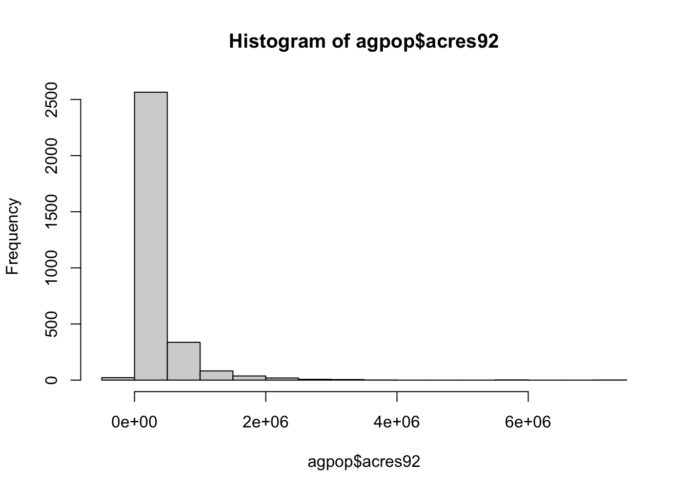

```r
######################## the first thing to do to use rstudio is 

# create a project and folder to save all your datasets, R files, and outputs

#################### input simple data into R #################################

# create a vector
x <- 1:10
x <- seq (30,3, by = -2)
a <- c(66.32, 69.87, 70.12, 90.37, 50.08, 61.20, 65.00, 57.65)
d <- a [1]
a [1] <- 85.34

mean (a)
```

```
## [1] 68.70375
```

```r
ma <- mean (a)
# read a vector of numbers from a file
x <- scan("numbers.txt")

# one can also read number withoug saving to a file
y <- scan(text = "7  8  9 10 11 12 13 13 14 17 17 45")

# create a matrix
A <- matrix (0, 4, 2)

A <- matrix (1:8, 4,2)

D <- matrix (a, 4, 2, byrow=T)

?matrix

D <- matrix(1:8, 2, 4)

# create another matrix with all entry 0
B <- matrix (0, 100, 50)
# assign a number to B
B[1,4] <- 4.5
B[1,] <- 1:50


# create a list
E <- list (newa = a, newA = A)
# list the names of components
names (E)
```

```
## [1] "newa" "newA"
```

```r
# to look at the component of E
E$newA 
```

```
##      [,1] [,2]
## [1,]    1    5
## [2,]    2    6
## [3,]    3    7
## [4,]    4    8
```

```r
E$newa <- 10:17

# create a dataframe
scores <- c (30, 45, 50)
names <- c("Peter", "John", "Alice")
stat245_scores <- data.frame (names, scores)
stat245_scores$names
```

```
## [1] "Peter" "John"  "Alice"
```

```r
stat245_scores$scores [2] <- 17
stat245_scores$perc <- stat245_scores$score/50 * 100 + 10


###############################################################################
#### import a dataset into R environment 
###############################################################################

# import myagpop.xls into an R data frame called 'myagpop'
agpop <- read.csv ("data/agpop.csv")

# Now, we can use the data:

# preview agpop
head (agpop)
```

```
##                  county state acres92 acres87 acres82 farms92 farms87 farms82 largef92
## 1 ALEUTIAN ISLANDS AREA    AK  683533  726596  764514      26      27      28       14
## 2        ANCHORAGE AREA    AK   47146   59297  256709     217     245     223        9
## 3        FAIRBANKS AREA    AK  141338  154913  204568     168     175     170       25
## 4           JUNEAU AREA    AK     210     214     127       8       8      12        0
## 5  KENAI PENINSULA AREA    AK   50810   85712   98035      93     119     137        9
## 6        AUTAUGA COUNTY    AL  107259  116050  145044     322     388     453       25
##   largef87 largef82 smallf92 smallf87 smallf82 region
## 1       16       20        6        4        1      W
## 2       10       11       41       52       38      W
## 3       28       21       12       18       25      W
## 4        0        0        5        4        8      W
## 5       18       17       12       18       19      W
## 6       32       32        8       19       17      S
```

```r
# look at the variable name
colnames (agpop) 
```

```
##  [1] "county"   "state"    "acres92"  "acres87"  "acres82"  "farms92"  "farms87" 
##  [8] "farms82"  "largef92" "largef87" "largef82" "smallf92" "smallf87" "smallf82"
## [15] "region"
```

```r
# find number of cols
ncol (agpop) 
```

```
## [1] 15
```

```r
# find number of rows
nrow (agpop) 
```

```
## [1] 3078
```

```r
# access a certain row
agpop [2, ]
```

```
##           county state acres92 acres87 acres82 farms92 farms87 farms82 largef92 largef87
## 2 ANCHORAGE AREA    AK   47146   59297  256709     217     245     223        9       10
##   largef82 smallf92 smallf87 smallf82 region
## 2       11       41       52       38      W
```

```r
# access a certain column
agpop [, "acres92"] ## equivalent to 
```

```
##    [1]  683533   47146  141338     210   50810  107259  167832  177189   48022  137426
##   [11]  144799   96427   73841  109555  121504   99466   67950   61426   68478   47200
##   [21]  175209  138135   82466   40832  166490  111315  196859  134555  233422  210733
##   [31]  104364   85872   85821   64755  130063  195536  128357  167583  166949  191810
##   [41]  204487   35748   56102  201892  173468   67962  207226  199714  138437  224370
##   [51]  199117   89228  142873  104342  110066  231243  155914  144193  106206  179319
##   [61]   96435  112620   78176   71697  167923  104199   78889   96194   50257   85086
##   [71]  141260   56680  411473  151325   92708  293745  250819   30196   18818  246184
##   [81]  269122   98919  313573  108046   34115   57253  167572  350402  145744  326808
##   [91]  324539   20589  262021  110260  210692  168755  223889   42794   37606  251710
##  [101]  168848   78498  105721  263182  183895  367969  281864  108913  107841  281895
##  [111]  298547  186685  143104  186829  382714  268075  142856  173861  484751  219444
##  [121]   79803   69422  102560   32003   67044  357416   70872  404585  122871  156363
##  [131]  313232  111895  253948  305401   45609  114762  195510  115019  131353  159013
##  [141]  136309   31190  119930  352322  358904  274843  190363 5785707 1891644 5989961
##  [151] 1151284 1846497  137834  246038  729947 1981938 7229585 3472248 1902452  334284
##  [161] 2108834  229365  286288    4768  236222  452347  246077  450236  163036   12594
##  [171]  102028 1774664  473920  597766  532866  247550 2839531  775829  164130  487499
##  [181]  183569  749465  168879  206138  725118  978831  686876  103294 1372778  235290
##  [191]   72471   60740  137723  119514  423602  379044  600073 1287057  517860       7
##  [201]  783715 1324403   57418  836989  342653   52905  388084   55446  647446  340328
##  [211]  517114  759649  318156 1016851  116083 1354262  137530  320597  518907  234781
##  [221]  685813  207448  322823  155465 1257229  796892  157493   84172  914094    7129
##  [231]  304592  330826  423785  156801  260728     -99  167106  231364  213004 1105614
##  [241]  857404  331639  440581   13296  299142  177333    9021  641755  472018  103470
##  [251]  878447 1341738   14411  587339  540412 2286947 1660146 1066453  420233   15539
##  [261] 1159813  834018  447412  751517  633279  119287  388902  459659   32072 1004360
##  [271]  896994  546538  219612  576397  462086     -99  200674  310394   38467  104010
##  [281] 1333577 2086292 1433111    9975   56510   86581   19830   25882   65987   38715
##  [291]   55263  197375   87134  304680  191140   24489    9135   36230  199724   23735
##  [301]   43314  227202   70672   86026  301977   96968   83681  334623   31693   40039
##  [311]   57179   52259     -99   57853   70987  369965   14203   69405  327611  529835
##  [321]   61019  483835  265443   86706  174673  244185  118352   95833  199098  106721
##  [331]  100764  190553   11738  132208  299699  296242  190788      32   44962   56704
##  [341]  351885  138418  716542  637934  221232    4123  611336  105621   48839  300622
##  [351]   79270  151242   59642  253330  161936     -99   48280  138208    8679   96730
##  [361]   45214  105538   77659   78739  108840   32976   49397   35851   85075   47071
##  [371]  129216   17105   62983   27561  168861   15948  213943  166511   29213  113861
##  [381]   17944   57074   82549   29451   21697    8518    5901   52651   33641   11559
##  [391]   42678    4519   13563   10192  178861  198184   26984   72636   41972   37973
##  [401]  109923   25802   19060  168593    3046   97215  156805   71135    8151  184137
##  [411]   16362   43775   54233  123702   40608   15577   22212   73659   36260   74641
##  [421]   21975   25376   28535    9681   73869  137637   46748   24239   36074   53944
##  [431]   35387   31529   31037   58529   24242   45624   73417  135247   83074   60811
##  [441]   72626  136082   77532   71379   31394   39712   40955  168051  104768   15583
##  [451]   32657   11969   73023   23284   33785    8003  120839   61757   45448   68729
##  [461]  121588  205573   44599   64901   93061   32950    4870   45845   51836   55310
##  [471]   18644   44470   18254   80905   45450   46014   80396   34746   11559   12733
##  [481]   95876   15974   12836   37923  138803  108967   24086   15521   49043  169989
##  [491]   38313   19314  119873   54356   71097  142824  174020  114487   88811    9910
##  [501]   32800   40783   98824   31161   21973   32865   88829   55779   53895   47000
##  [511]  111801   54445   53291   48755   24127   38691  115516   93078   31838  200061
##  [521]  926607   91998  214452  355786  328970  239800  321728  238609  268506  427215
##  [531]  299502  330080  236668  333115  341923  315448  345567  359755  347353  338801
##  [541]  308497  336254  274905  236409  314812  456954  368114  415104  312173  275319
##  [551]  261494  336131  192467  202249  343870  224811  401625  287586  343367  302352
##  [561]  366927  317205  328885  332377  329151  332358  399155  225835  260781  280797
##  [571]  272831  321285  346569  431185  227073  284537  321950  322401  615034  266083
##  [581]  349252  191291  219370  347599  305685  314887  268520  312858  237862  263047
##  [591]  392835  223638  240100  219832  362109  260780  318778  338730  518247  359442
##  [601]  229818  542855  340982  293266  364172  233217  353570  495769  331211  401858
##  [611]  278922  236265  241422  195021  302487  309508  282723  408462  231977  357684
##  [621]  442247  224632  353683  232879  221209  325338  269435  111510 1371605  266293
##  [631]   80333  150021  453647   72664  159358  129490  391050  587693  666342  286711
##  [641]  103246  140701  353528  230086  380928  197176  227114  744295  311296  207552
##  [651]  131281  347293  193908  211039  132429  224369  208161  477839  271143  752032
##  [661]  148776  435069    4428  134788  489993   78813  556131  464834   69354  182572
##  [671]  135163  144435  482169   99675  238906  209437  571807  390149  259923  223764
##  [681]  229120  263425   40917  223561  176012  377512  206271  259498   18206  354480
##  [691]  116312  257761  341274  300127  160533  431415  171938  303715  225506  201567
##  [701]  433246   37976  203974  453944  662629  186425  258014  217191  180675  290454
##  [711]   94681  203590  358920  178222  385560   73142  612112  169292  414442  637551
##  [721]  369952  344649  249240  709106  310518  402310  299709  253916  203749  282222
##  [731]   98838  164158  312128  187039  371936  311266  184599  392639  261482  167602
##  [741]  251277  443475   67998   82426   78081  270598  188999  175847  264140  141703
##  [751]  446750  207388  128867  402212  169622  314886  336450  119370  488215  115517
##  [761]  317467  297003  333238  234973  399312  325227   89591  203428  295844  197724
##  [771]  285730  165091  270618   87329  223429   22555  220057  227711  105658  162433
##  [781]  236073   59734  222435   86236  202429  153213  169265  193381  192311  111500
##  [791]   29837  229097  148662  194312  241049  196537  207766  162670  163248  161745
##  [801]  187079  190798  148609  187955  202896  301962  182836  130826  124694  139638
##  [811]  305634  251603  187549  144305  267695  158788  223328   38783  219402   71596
##  [821]  188843   59282  282764  139523  206885  184118   32318  116068  113129  181653
##  [831]   80078   85366  142482  220959  242777  204165  236436  164025  233183  172348
##  [841]   63332  217288  175124  134960  121710  181020   79235  257351  160930   80069
##  [851]   80958  119318  144722  197947  201739   96219  189136  189467  198680  285169
##  [861]  162244  282862  378517  245099  639327  580199  337300  339138  765688  351941
##  [871]  386881  271015  592207  565274  380969  407464  353371  486997  627612  302849
##  [881]  526064  514436  201798  222028  403375  324063  547483  442362  745371  671223
##  [891]  316317  164081  671506  512728  341608  517623  424104  603755  532890  499112
##  [901]  319686  366764  479903  340035  271713  484823  141386  517376  544071  399835
##  [911]  346519  419423  206530  482434  273841  603177  485656  537914  588061  572989
##  [921]  596103  286989  479310  323769  409839  427403  441417  326716  668420  465527
##  [931]  349293  547369  380403  449151  582053  451362  432326  641109  700869  443290
##  [941]  432701  228178  578283  427459  463690  403276  484415  510319  328094  227349
##  [951]  535359  620144  537457  436242  411785  450829  687593  702549  484093  423064
##  [961]  471658  521110  443802  312717  265978   22553  177858  156590   90033  111913
##  [971]  248634  132979    5419   80864  206881   27836  108291   99009   42602  266730
##  [981]   60911  140810  128807  137337   43447   78966   60812  112831  192189  299321
##  [991]  144904   68373   75409  125133  108777  250128   92487   60294   69310  147154
##  [ reached getOption("max.print") -- omitted 2078 entries ]
```

```r
agpop$acres92
```

```
##    [1]  683533   47146  141338     210   50810  107259  167832  177189   48022  137426
##   [11]  144799   96427   73841  109555  121504   99466   67950   61426   68478   47200
##   [21]  175209  138135   82466   40832  166490  111315  196859  134555  233422  210733
##   [31]  104364   85872   85821   64755  130063  195536  128357  167583  166949  191810
##   [41]  204487   35748   56102  201892  173468   67962  207226  199714  138437  224370
##   [51]  199117   89228  142873  104342  110066  231243  155914  144193  106206  179319
##   [61]   96435  112620   78176   71697  167923  104199   78889   96194   50257   85086
##   [71]  141260   56680  411473  151325   92708  293745  250819   30196   18818  246184
##   [81]  269122   98919  313573  108046   34115   57253  167572  350402  145744  326808
##   [91]  324539   20589  262021  110260  210692  168755  223889   42794   37606  251710
##  [101]  168848   78498  105721  263182  183895  367969  281864  108913  107841  281895
##  [111]  298547  186685  143104  186829  382714  268075  142856  173861  484751  219444
##  [121]   79803   69422  102560   32003   67044  357416   70872  404585  122871  156363
##  [131]  313232  111895  253948  305401   45609  114762  195510  115019  131353  159013
##  [141]  136309   31190  119930  352322  358904  274843  190363 5785707 1891644 5989961
##  [151] 1151284 1846497  137834  246038  729947 1981938 7229585 3472248 1902452  334284
##  [161] 2108834  229365  286288    4768  236222  452347  246077  450236  163036   12594
##  [171]  102028 1774664  473920  597766  532866  247550 2839531  775829  164130  487499
##  [181]  183569  749465  168879  206138  725118  978831  686876  103294 1372778  235290
##  [191]   72471   60740  137723  119514  423602  379044  600073 1287057  517860       7
##  [201]  783715 1324403   57418  836989  342653   52905  388084   55446  647446  340328
##  [211]  517114  759649  318156 1016851  116083 1354262  137530  320597  518907  234781
##  [221]  685813  207448  322823  155465 1257229  796892  157493   84172  914094    7129
##  [231]  304592  330826  423785  156801  260728     -99  167106  231364  213004 1105614
##  [241]  857404  331639  440581   13296  299142  177333    9021  641755  472018  103470
##  [251]  878447 1341738   14411  587339  540412 2286947 1660146 1066453  420233   15539
##  [261] 1159813  834018  447412  751517  633279  119287  388902  459659   32072 1004360
##  [271]  896994  546538  219612  576397  462086     -99  200674  310394   38467  104010
##  [281] 1333577 2086292 1433111    9975   56510   86581   19830   25882   65987   38715
##  [291]   55263  197375   87134  304680  191140   24489    9135   36230  199724   23735
##  [301]   43314  227202   70672   86026  301977   96968   83681  334623   31693   40039
##  [311]   57179   52259     -99   57853   70987  369965   14203   69405  327611  529835
##  [321]   61019  483835  265443   86706  174673  244185  118352   95833  199098  106721
##  [331]  100764  190553   11738  132208  299699  296242  190788      32   44962   56704
##  [341]  351885  138418  716542  637934  221232    4123  611336  105621   48839  300622
##  [351]   79270  151242   59642  253330  161936     -99   48280  138208    8679   96730
##  [361]   45214  105538   77659   78739  108840   32976   49397   35851   85075   47071
##  [371]  129216   17105   62983   27561  168861   15948  213943  166511   29213  113861
##  [381]   17944   57074   82549   29451   21697    8518    5901   52651   33641   11559
##  [391]   42678    4519   13563   10192  178861  198184   26984   72636   41972   37973
##  [401]  109923   25802   19060  168593    3046   97215  156805   71135    8151  184137
##  [411]   16362   43775   54233  123702   40608   15577   22212   73659   36260   74641
##  [421]   21975   25376   28535    9681   73869  137637   46748   24239   36074   53944
##  [431]   35387   31529   31037   58529   24242   45624   73417  135247   83074   60811
##  [441]   72626  136082   77532   71379   31394   39712   40955  168051  104768   15583
##  [451]   32657   11969   73023   23284   33785    8003  120839   61757   45448   68729
##  [461]  121588  205573   44599   64901   93061   32950    4870   45845   51836   55310
##  [471]   18644   44470   18254   80905   45450   46014   80396   34746   11559   12733
##  [481]   95876   15974   12836   37923  138803  108967   24086   15521   49043  169989
##  [491]   38313   19314  119873   54356   71097  142824  174020  114487   88811    9910
##  [501]   32800   40783   98824   31161   21973   32865   88829   55779   53895   47000
##  [511]  111801   54445   53291   48755   24127   38691  115516   93078   31838  200061
##  [521]  926607   91998  214452  355786  328970  239800  321728  238609  268506  427215
##  [531]  299502  330080  236668  333115  341923  315448  345567  359755  347353  338801
##  [541]  308497  336254  274905  236409  314812  456954  368114  415104  312173  275319
##  [551]  261494  336131  192467  202249  343870  224811  401625  287586  343367  302352
##  [561]  366927  317205  328885  332377  329151  332358  399155  225835  260781  280797
##  [571]  272831  321285  346569  431185  227073  284537  321950  322401  615034  266083
##  [581]  349252  191291  219370  347599  305685  314887  268520  312858  237862  263047
##  [591]  392835  223638  240100  219832  362109  260780  318778  338730  518247  359442
##  [601]  229818  542855  340982  293266  364172  233217  353570  495769  331211  401858
##  [611]  278922  236265  241422  195021  302487  309508  282723  408462  231977  357684
##  [621]  442247  224632  353683  232879  221209  325338  269435  111510 1371605  266293
##  [631]   80333  150021  453647   72664  159358  129490  391050  587693  666342  286711
##  [641]  103246  140701  353528  230086  380928  197176  227114  744295  311296  207552
##  [651]  131281  347293  193908  211039  132429  224369  208161  477839  271143  752032
##  [661]  148776  435069    4428  134788  489993   78813  556131  464834   69354  182572
##  [671]  135163  144435  482169   99675  238906  209437  571807  390149  259923  223764
##  [681]  229120  263425   40917  223561  176012  377512  206271  259498   18206  354480
##  [691]  116312  257761  341274  300127  160533  431415  171938  303715  225506  201567
##  [701]  433246   37976  203974  453944  662629  186425  258014  217191  180675  290454
##  [711]   94681  203590  358920  178222  385560   73142  612112  169292  414442  637551
##  [721]  369952  344649  249240  709106  310518  402310  299709  253916  203749  282222
##  [731]   98838  164158  312128  187039  371936  311266  184599  392639  261482  167602
##  [741]  251277  443475   67998   82426   78081  270598  188999  175847  264140  141703
##  [751]  446750  207388  128867  402212  169622  314886  336450  119370  488215  115517
##  [761]  317467  297003  333238  234973  399312  325227   89591  203428  295844  197724
##  [771]  285730  165091  270618   87329  223429   22555  220057  227711  105658  162433
##  [781]  236073   59734  222435   86236  202429  153213  169265  193381  192311  111500
##  [791]   29837  229097  148662  194312  241049  196537  207766  162670  163248  161745
##  [801]  187079  190798  148609  187955  202896  301962  182836  130826  124694  139638
##  [811]  305634  251603  187549  144305  267695  158788  223328   38783  219402   71596
##  [821]  188843   59282  282764  139523  206885  184118   32318  116068  113129  181653
##  [831]   80078   85366  142482  220959  242777  204165  236436  164025  233183  172348
##  [841]   63332  217288  175124  134960  121710  181020   79235  257351  160930   80069
##  [851]   80958  119318  144722  197947  201739   96219  189136  189467  198680  285169
##  [861]  162244  282862  378517  245099  639327  580199  337300  339138  765688  351941
##  [871]  386881  271015  592207  565274  380969  407464  353371  486997  627612  302849
##  [881]  526064  514436  201798  222028  403375  324063  547483  442362  745371  671223
##  [891]  316317  164081  671506  512728  341608  517623  424104  603755  532890  499112
##  [901]  319686  366764  479903  340035  271713  484823  141386  517376  544071  399835
##  [911]  346519  419423  206530  482434  273841  603177  485656  537914  588061  572989
##  [921]  596103  286989  479310  323769  409839  427403  441417  326716  668420  465527
##  [931]  349293  547369  380403  449151  582053  451362  432326  641109  700869  443290
##  [941]  432701  228178  578283  427459  463690  403276  484415  510319  328094  227349
##  [951]  535359  620144  537457  436242  411785  450829  687593  702549  484093  423064
##  [961]  471658  521110  443802  312717  265978   22553  177858  156590   90033  111913
##  [971]  248634  132979    5419   80864  206881   27836  108291   99009   42602  266730
##  [981]   60911  140810  128807  137337   43447   78966   60812  112831  192189  299321
##  [991]  144904   68373   75409  125133  108777  250128   92487   60294   69310  147154
##  [ reached getOption("max.print") -- omitted 2078 entries ]
```

```r
agpop$largef92
```

```
##    [1]  14   9  25   0   9  25  24  40   6   9  29  18   4  22  24   8   9  13   4   5
##   [21]  29  37  15   3  22  21   5  30  71  13  15  15   6   4  12  34  41  38  50  38
##   [41]  33   3   4  37  27  10  49  56  30  59  48   7   7  19  18  61  14  29  18  45
##   [61]  10  25   6   8  41  18   9  20   6  13  34   0 164  53  12  21  31   1   0  33
##   [81]  91  15  96   7   2   6  22  94  25 123 104   0  96  36  23  27  29   1   3  62
##  [101]  30   7  13  52  15 124 105   9  31  74  98  53  26  21 116  27  22  47 186  87
##  [121]   4   6   5   2   6 108   6 136   7  20 112  30  53 107   2  11  32  14  11  21
##  [141]  15   1  11  29  50  92  26 101 241  75  21  64   8  31 127  76  92  88 140  42
##  [161] 106  63  39   2  32  72  56  98  37   3  13 351 104 114 151  17 346  97  35  85
##  [181]  26 139  67  48 118 180 129  16 223  48  14   8  34  26  83  90 108  33  65   0
##  [201] 165 252  14 156  52  10  81  16 124  81 110 139  70 124  11 244  32  60 116  34
##  [221] 150  47  73  33 305  90  34  18 220   3  66  21  71  40  60   1  50  54  29 237
##  [241] 170  67  81   4  56  48   2 107  76  26 180 394   4  67  91 214 294 314  73   5
##  [261] 134  70  76 164  78  28  55 166  11 187 131  87  51 127  87   1  30  90   7  19
##  [281] 402 411 421   0   3   8   1   1   1   6   6  41  25  65  43   3   2   4  31   5
##  [301]  13  22  11  12  50  12  13  55   3   8   5  14   0   7  10  31   2  13  59  57
##  [321]  11  79  45   8  24  50  22  10  43  26  11  35   1  20  62  46  46   0   7   5
##  [341]  75  30  59  67  46   1 110  17  13  46  11  23  10  33  17  12   5  22   1  10
##  [361]   4  13  12   8  28   6   1   2  10  10  23   1  15   0  35   3  61  57   4  39
##  [381]   5   5   4   1   2   4   0   4   1   1  14   0   1   0  26  47   5  16   2   7
##  [401]  41   3   2  47   0  17  51  17   0  56   4  10   5  31   9   0   0   9   5   2
##  [421]   3   1   6   1   6  31   6   1   1   1   9   1   4   4   2   4  17  35   8  10
##  [441]   9  25  26  11   1   5   9  35  30   3   5   2   9   1   4   2  39   1   9  13
##  [461]  36  64   5  13  16   5   1   9   8   9   1  11   0  15   7   3  21   5   4   2
##  [481]  36   2   2  10  41  27   2   0  11  44   6   2  20  12  13  50  40  28  17   0
##  [501]   5   3  29   9   0   4   7   5  10   7  26  11  18   6   1   1  31  17   5  63
##  [521]  55  10  13  26  56  38  46  28  45  56  49  69  25  50  38  32  58  39  70  40
##  [541]  53  41  36  42  58  35  34  61  67  49  52  25  33  30  13  31  48  49  51  91
##  [561]  78  55  60  58  44  56  88  31  40  44  48  43  28  82  38  27  34  55  82  42
##  [581]  44  30  35  32  47  32  34  55  58  36 104  31  40  31  38  44  46  48  72  52
##  [601]  48  99  56  67  56  31  41  38  56  52  50  31  35  26  54  32  49  76  38  16
##  [621]  85  44  73  35  41  79  65  39 162  54  14  18 115  20  44  43  51 120 164  35
##  [641]  24  36  58  57  79  38  41 176  82  43  29 115  52  79  26  69  37 102  77  91
##  [661]  19 133   0  44  76  18 100  85  20  28  17  40  95  15  48  64 110 117  74  45
##  [681]  20  74  10  66  29  73  45  74   7 104  30  23  67  85  40  88  52  71  51  51
##  [701]  98   4  48  76 141  36  41  40  40  43  15  46  82  42  93  19  97  59  82 119
##  [721]  88  89  46 176  94  80  54  45  41  77  23  54  72  45  64  70  54  73  53  28
##  [741]  67 116   8  23  12  50  44  31  55  31 132  64  37  73  44  42  70  21 132  36
##  [761]  64  57  84  81  77  75  13  46  44  25  46  33  74  23  58   1  61  50  12  34
##  [781]  57   3  43   2  38  31  38  24  20  11   0  57   8  47  67  49  29  33  49  12
##  [801]  38  39  21  39  29  78  36  12  14  26  86  47  28  36  66  23  58   5  46   7
##  [821]  33   3  77  36  65  21   2  13  14  56   1  12  32  78  69  45  39  18  43  32
##  [841]  10  54  34  39  19  52   4  70  47   8  15  32  40  37  61  21  21  32  36  84
##  [861]  33  81 107  55 168 188  75 102 201  80 101  78 189 124 143 150 114 124 158  73
##  [881] 188 158  51  48 129  92 162 163 235 235  71  61 227 179 123 181 115 132 163 166
##  [901]  79 120 177  74  53 182  29 140 181 129  94 137  35 165  60 174 134 130 150 151
##  [921] 177  59 191  74 119 112  77  75 238 154  84 208 124 165 197 129 157 236 232 140
##  [941] 140  59 181 153 169 125 163 133 112  46 216 211 203 167 148 155 251 236 185 113
##  [961] 142 184 161  96  82   4   7   8   6  28   9  11   0   3  31   3  14   3   2  21
##  [981]   4  18  21  32   0  17   6   3  18  67  22   3   5  17   7  57   2   0   2  27
##  [ reached getOption("max.print") -- omitted 2078 entries ]
```

```r
# find mean of acres92
mean (agpop $acres92)
```

```
## [1] 306677
```

```r
# find sd of acres92
sd (agpop $acres92)
```

```
## [1] 424686.7
```

```r
agpop_AK  <- agpop [agpop$state == "AK", ]

agpop_AK <- subset (agpop, state == "AK")

agpop_W <- subset (agpop, region == "W")

agpop_largefarm <- subset (agpop, largef92 > 10)

## simple analysis
summary (agpop)
```

```
##     county             state              acres92           acres87       
##  Length:3078        Length:3078        Min.   :    -99   Min.   :    -99  
##  Class :character   Class :character   1st Qu.:  80903   1st Qu.:  86236  
##  Mode  :character   Mode  :character   Median : 191648   Median : 199864  
##                                        Mean   : 306677   Mean   : 313016  
##                                        3rd Qu.: 366886   3rd Qu.: 372224  
##                                        Max.   :7229585   Max.   :7687460  
##     acres82           farms92          farms87          farms82          largef92     
##  Min.   :    -99   Min.   :   0.0   Min.   :   0.0   Min.   :   0.0   Min.   :  0.00  
##  1st Qu.:  96397   1st Qu.: 295.0   1st Qu.: 318.5   1st Qu.: 345.0   1st Qu.:  8.00  
##  Median : 207292   Median : 521.0   Median : 572.0   Median : 616.0   Median : 30.00  
##  Mean   : 320194   Mean   : 625.5   Mean   : 678.3   Mean   : 728.1   Mean   : 56.18  
##  3rd Qu.: 377065   3rd Qu.: 838.0   3rd Qu.: 921.0   3rd Qu.: 991.0   3rd Qu.: 75.00  
##  Max.   :7313958   Max.   :7021.0   Max.   :7590.0   Max.   :7394.0   Max.   :579.00  
##     largef87         largef82         smallf92          smallf87          smallf82      
##  Min.   :  0.00   Min.   :  0.00   Min.   :   0.00   Min.   :   0.00   Min.   :   0.00  
##  1st Qu.:  8.00   1st Qu.:  8.00   1st Qu.:  13.00   1st Qu.:  17.00   1st Qu.:  16.00  
##  Median : 27.00   Median : 25.00   Median :  29.00   Median :  35.00   Median :  34.00  
##  Mean   : 54.86   Mean   : 52.62   Mean   :  54.09   Mean   :  59.54   Mean   :  60.97  
##  3rd Qu.: 70.00   3rd Qu.: 65.00   3rd Qu.:  59.00   3rd Qu.:  67.00   3rd Qu.:  67.00  
##  Max.   :596.00   Max.   :546.00   Max.   :4298.00   Max.   :3654.00   Max.   :3522.00  
##     region         
##  Length:3078       
##  Class :character  
##  Mode  :character  
##                    
##                    
## 
```

```r
hist (agpop$acres92)
```



```r
# to save plot in a file

pdf ("hist_acres92.pdf")
hist (agpop$acres92)
dev.off()
```

```
## quartz_off_screen 
##                 2
```

```r
jpeg ("agpop_acres_87v92.jpg")

plot (agpop$acres87, agpop$acres92)
abline (a = 0, b = 1)

dev.off()
```

```
## quartz_off_screen 
##                 2
```

```r
## create your own function

## data is a matrix or data.frame
means_col <- function (data)
{
    n <- ncol (data)
    cmeans <- rep (NA, n)
    for (j in 1:n)
    {
        cmeans[j] <- mean (data[,j])
        
    }
    cmeans
}

## apply function
means_col (agpop[, 3:13])
```

```
##  [1] 306676.97141 313016.37817 320193.69298    625.50357    678.28428    728.06238
##  [7]     56.17674     54.86160     52.62248     54.09227     59.53769
```

```r
## R built-in function
colMeans (agpop[, 3:13])
```

```
##      acres92      acres87      acres82      farms92      farms87      farms82 
## 306676.97141 313016.37817 320193.69298    625.50357    678.28428    728.06238 
##     largef92     largef87     largef82     smallf92     smallf87 
##     56.17674     54.86160     52.62248     54.09227     59.53769
```


---
title: introduction_short.R
author: lol553
date: '2022-09-02'

---
