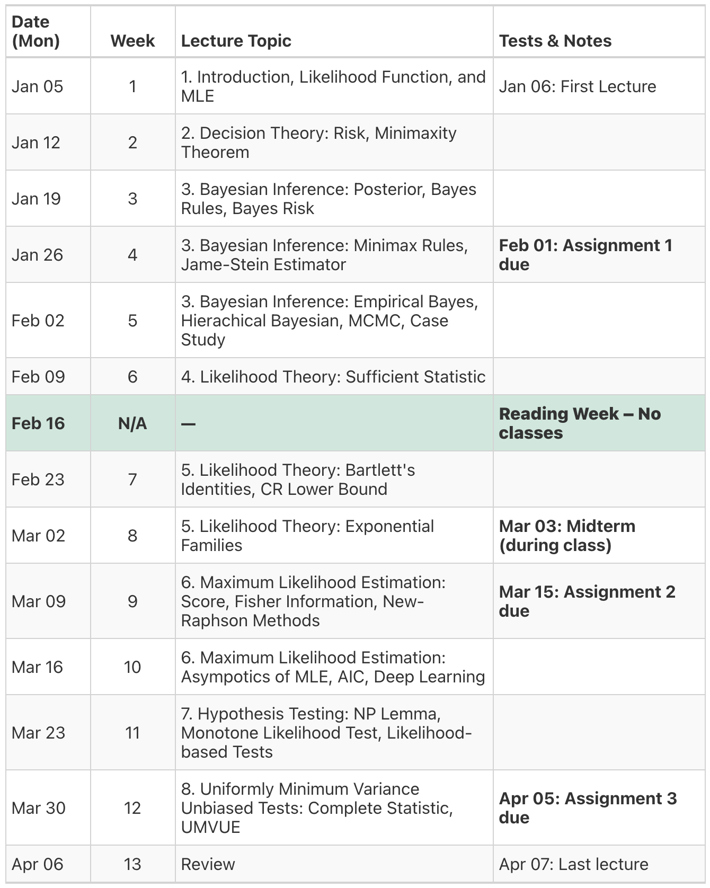

## Description

This course presents a rigorous theoretical treatment of statistical inference, offering a comparative analysis of frequentist and Bayesian paradigms. The curriculum explores several core areas of statistical theory, beginning with foundational concepts in Decision theory (Risk Function, Minimaxity Theorem) before moving into a comprehensive treatment of Bayesian inference (Posterior, Bayes Rules, Bayes Risk, Minimax Rules, James-Stein Estimator, Empirical Bayes, Hierarchical Bayesian, MCMC, Case Study). The course then transitions to focus heavily on Likelihood theory (Sufficient Statistic, Bartlett's Identities, Cramér-Rao Lower Bound, Exponential Families) and the mechanics of MLE (Score, Fisher Information, Newton-Raphson Methods, Asymptotics of Maximum Likelihood Estimators, Alkeike Information Criteria, Deep Learning). Finally, we cover hypothesis testing and optimal point estimation through the lens of the Likelihood ratio test (Neyman-Pearson Lemma, Monotone Likelihood Test, Likelihood-based Tests) and UMVUE (Complete Statistic, Uniformly Minimum Variance Unbiased Estimators/Tests).

**Prerequisite(s):** STAT 342. 

This course requires a strong command of multivariate calculus, alongside a rigorous foundation in intermediate probability theory including asymptotic theorey for probability. Students should also possess prior exposure to applied statistical methods and familiar with basic statistical concepts such as standard error, p-value, and confidence internal.

## Instructor
* [Longhai Li](https://longhaisk.github.io), Professor
* Department of Mathematics and Statistics, University of Saskatchewan
* Email: longhai.li@usask.ca.

## Times and Places
* **Lectures:** TTH 11:30-12:20, MCLN 242.1
* **Office Hours:** TBA
* **No lab**

## Textbook and Course Materials

* [The course page](https://longhaisk.github.io/teaching/stat850/) contains the links to my lecture notes and assingments.

* **Recommended Text:** 

  Young G. A. & R. L. Smith, *Essentials of Statistical Inference*, Cambridge University Press, 2005. 


## Tentative Schedule

```{r find-mondays}
#| echo: false
#| eval: false

# 1. Set the first Monday for Winter Term 2026
start_date <- as.Date("2026-01-05")

# 2. Generate the next 14 weeks
dates <- seq(from = start_date, by = "week", length.out = 14)

# 3. Print the vector in a copy-paste friendly format
dput(format(dates, "%b %d"))
```

```{r}
#| echo: false
#| message: false
#| warning: false
#| out-width: "100%"
#| out-extra: "style='width: 100% !important;'" 

library(gt)
library(dplyr)
library(knitr)
# 1. SETUP: Compact CSV text block
# (Note: Topics with commas still need quotes "")
# 1. SETUP: Compact CSV text block
# (Note: All Topics are now wrapped in \"quotes\" for consistency)
# 1. SETUP: Compact CSV text block
# (Note: All Topics are now wrapped in \"quotes\" for consistency)
# Edit the text between the quotes below
csv_text <- "
Date,   Acad_Week, Topic,                                                           Remarks
Jan 05, 1,         \"1. Introduction, Likelihood Function, and MLE\",                 Jan 06: First Lecture
Jan 12, 2,         \"2. Decision Theory: Risk, Minimaxity Theorem\",
Jan 19, 3,         \"3. Bayesian Inference: Posterior, Bayes Rules, Bayes Risk\",
Jan 26, 4,         \"3. Bayesian Inference: Minimax Rules, Jame-Stein Estimator\",    **Feb 01: Assignment 1 due**
Feb 02, 5,         \"3. Bayesian Inference: Empirical Bayes, Hierachical Bayesian, MCMC, Case Study\",
Feb 09, 6,         \"4. Likelihood Theory: Sufficient Statistic\",
Feb 16, N/A,       \"—\",                                                             **Reading Week – No classes**
Feb 23, 7,         \"5. Likelihood Theory: Bartlett's Identities, CR Lower Bound\",
Mar 02, 8,         \"5. Likelihood Theory: Exponential Families\",                                          **Mar 03: Midterm (during class)**
Mar 09, 9,         \"6. Maximum Likelihood Estimation: Score, Fisher Information, New-Raphson Methods\",                              **Mar 15: Assignment 2 due**
Mar 16, 10,        \"6. Maximum Likelihood Estimation: Asympotics of MLE, AIC, Deep Learning\",
Mar 23, 11,        \"7. Hypothesis Testing: NP Lemma, Monotone Likelihood Test, Likelihood-based Tests\",
Mar 30, 12,        \"8. Uniformly Minimum Variance Unbiased Tests: Complete Statistic, UMVUE\",     **Apr 05: Assignment 3 due**
Apr 06, 13,        \"Review\",                                                        Apr 07: Last lecture
"

# Convert the text block into a dataframe
# strip.white = TRUE ensures the alignment spaces are ignored during import
schedule_data <- read.csv(text = csv_text, strip.white = TRUE, stringsAsFactors = FALSE)

# Fill empty remarks with empty strings
schedule_data$Remarks[is.na(schedule_data$Remarks)] <- ""


# View Result

# 4. CREATE THE TABLE
gt_tbl <- schedule_data %>%
  gt() %>%
  cols_label(
    Acad_Week = "Week",
    Date = "Date (Mon)",
    Topic = "Lecture Topic",
    Remarks = "Tests & Notes"
  ) %>%
  fmt_markdown(columns = c(Remarks)) %>%
  cols_align(align = "center", columns = c(Acad_Week)) %>%
  cols_align(align = "left", columns = c(Date, Topic, Remarks)) %>%
  cols_width(
    Topic ~ px(300),
    Remarks ~ px(200),
    everything() ~ px(80)
  ) %>%
  opt_row_striping() %>%
  
  # --- CRITICAL STYLING ---
  tab_options(
    # Body Grid
    table_body.hlines.style = "solid",
    table_body.vlines.style = "solid",
    
    # Header Grid
    column_labels.vlines.style = "solid",
    column_labels.border.top.style = "solid",
    column_labels.border.bottom.style = "solid",
    
    # Outer Border
    table.border.top.style = "solid",
    table.border.bottom.style = "solid",
    
    # Adjust font for image readability
    table.font.size = px(16)
  ) %>%
  
  # Bold Headers
  tab_style(
    style = cell_text(weight = "bold"),
    locations = cells_column_labels()
  ) %>%
  
  # Highlight Reading Week
  tab_style(
    style = list(
      cell_fill(color = "#d1e7dd"),
      cell_text(weight = "bold")
    ),
    locations = cells_body(rows = 7)
  )


# 5. SAVE & INSERT IMAGE
if (!knitr::is_html_output()) {
  gtsave(gt_tbl, "schedule_snapshot.png", vwidth = 1800) 
  
} else{
  gt_tbl
}

```

:::{.callout-important}
The schedule may change depending on the course pace. The exact assignment and test dates  are given on Canvas. 
:::


## Learning Outcomes 

After completing this course, students are expected to grasp the following knowledges and skills:

```{r}
#| echo: false
library(gt)
library(dplyr)

# Constructing the dataframe with updated Bayesian Inference skills
final_guide <- data.frame(
  Topic = c(
    "Decision Theory",
    "Bayesian Inference",
    "Likelihood Theory",
    "Maximum Likelihood Estimation",
    "Hypothesis Testing",
    "UMVUE"
  ),
  Knowledge = c(
    "Understand risk functions, admissibility, and the theoretical foundation of decision rules.",
    "Define prior/posterior distributions and Bayes risk. Understand shrinkage via the James-Stein estimator, Empirical Bayes, hierarchical models, and MCMC principles.",
    "Define minimal sufficient statistic. Understand Bartlett's Identities, the Cramér-Rao Lower Bound (CRLB), and the mathematical properties of Exponential Families.",
    "Define the score function and Fisher Information. Understand the Newton-Raphson algorithm, MLE asymptotic normality, and information criteria (AIC).",
    "Grasp the size, power,  Neyman-Pearson Lemma, Monotone Likelihood Ratios (MLR), and the theoretical logic of likelihood-based testing.",
    "Understand completeness, the Lehmann-Scheffé theorem, and Rao-Blackwell Theorem."
  ),
  Skills = c(
    "Calculate frequentist risk function for given estimators and evaluate admissibility under simple loss functions.",
    "Derive posterior distributions, find Bayes estimators, calculate Bayes risk, and find minimax rules.",
    "Identify minimal sufficient statistic, compute Fisher Information matrices, Bartlett Identities, verify CRLB attainment,  identify natural parameters and calculate moments of suff. statistics in Exponential Families",
    "Derive MLEs analytically, calculate asymptotic variances using Fisher information, find the asymptotic distributions of estimators, compute AIC. ",
    "Construct UMP tests using MLR, derive Likelihood Ratio tests, Score tests, and Wald tests with specified rejection regions.",
    "Derive UMVUE in exponential families."
  ),
  Percentages = c("10%", "20%", "10%", "30%", "20%","10%")
)


# Generate the gt table
final_guide %>%
  gt() %>%
  cols_label(
    Topic = md("**Topic**"),
    Knowledge = md("**Knowledge**"),
    Skills = md("**Skills**"),
    Percentages = md("**Perc**")
  ) %>%
  tab_style(
    style = cell_text(weight = "bold"),
    locations = cells_body(columns = Topic)
  ) %>%
  # Apply zebra striping first
  opt_row_striping() %>%
  tab_options(
    table.width = pct(100),
    column_labels.background.color = "#E0E0E0",
    column_labels.font.weight = "bold",
    
    # 1. Explicitly set the alternating row shade
    row.striping.background_color = "#F5F5F5",
    
    # 2. Force the horizontal row lines between every row
    table_body.hlines.color = "#B0B0B0", 
    table_body.hlines.width = px(1),
    table_body.hlines.style = "solid"
  ) %>%
  opt_align_table_header(align = "left") %>%
  cols_width(
    Topic ~ px(100),
    Knowledge ~ px(400),
    Skills ~ px(400),
    Percentages ~ px(20)
  )

```

## Evaluation

### Grading Scheme

**3 Assignments: 3 x 10%, 1 Term Test: 20%, 1 Final Exam: 50%.**


### Assignments and Tests
**Assignment questions are released in the one-drive folder**. You will submit your solutions via Canvas. **If you miss an assignment without proper excuse, the weight will NOT be shifted to the final.** Undergraduate students will be assigned with different assignments and tests.

### Assignments

* I will accept late assignments only for three (3) days beyond the due date. The penalty for your delay is 10 percentage points per day of lateness from the value of the assignment (including weekends). **Extensions are only granted in rare instances (notably as a result of family or medical emergencies) and upon receipt of adequate documentation/proof.**
* Answer the questions in the order they appear in the assignment. Neatness is important.
* Solutions to problems are to be included. Hence, simple answers without work will receive few (or no!) marks.
* Most problems in statistics have a “real-life” basis. Hence, solutions should include not only numerical solutions but also a statement as to what the numbers say about the problem.
* The work handed in must not be an exact duplicate of others.
* Submitting Assignments: The assignment can be typed and/or handwritten. Save your assignment as **one PDF file** (for handwritten assignments, feel free to take a picture/scan of your work and save it as one PDF file). Upload the **PDF file** as an assignment submission in Canvas.
* More details will be provided ahead of each assignment.
* Due Date: See Course Schedule.

### Midterm
* The midterm is given in class period.
* Midterms must be written on the dates scheduled. Students must do midterms completely on their own. More details (including syllabus) will be provided ahead of each midterm.
* Type: Short-answer questions, problem-solving, open-book.
* Calculator: A scientific calculator is allowed.
* Make-up exam will not be given. If you miss an exam for a legitimate reason (e.g., illness, emergency) and notify me within 48 hours of the scheduled exam, the weight of the missed exam will be transferred to the final exam.

### Final Exam
* Scheduling: Final examinations may be scheduled at any time during the examination period; students should therefore avoid making prior travel, employment, or other commitments for this period. If a student is unable to write an exam through no fault of their own for medical or other valid reasons, documentation must be provided and an opportunity to write the missed exam may be given. Students are encouraged to review all examination policies and procedures: [http://students.usask.ca/academics/exams.php](http://students.usask.ca/academics/exams.php).
* The final exam will cover material of the entire course. More details will be provided ahead of the exam.
* Length: 3-hour in-person exam.
* Type: Short-answer questions, problem-solving, open-book.

### Criteria That Must Be Met to Pass
The **final exam is a required component of the course**. Students must complete the final exam in order to be eligible to receive a passing grade in this class.

## Attendance Expectation
Attendance is highly correlated with student performance. While a syllabus and suggested readings are provided, it is not an adequate substitute for attending class. Your **attendance is highly recommended** but not required, and you will not be graded on your attendance.


## Recording of the Course
Recording of the lectures will only be allowed in certain circumstances. Please see the instructor for information on how to receive approval. In general, there will be no videos available for in-person lectures. Therefore, **attendance is strongly recommended**.

## Use of Generative AI and Electronic Devices

1. AI for Learning vs. Assessment. Students are free (and encouraged) to use Generative AI tools as a study aid to understand course concepts, debug code, or explain complex theorems. However, **all submitted work for assignments must be your own.** You must write your own solutions. Directly copying text, derivations, or code from an AI tool and submitting it as your own may receive a **severe penalty** (up to receiving a 0% on the assignment.
  
2. Electronic Devices During Tests. All term tests and the final exam are **Open Book**, meaning you may bring printed notes, textbooks, and lecture slides.
  
  * **No Electronic Devices:** You are **NOT allowed** to use laptops, tablets, smartwatches, or any other electronic devices during the exam.
    
  * **Phone Exception:** You are permitted to bring a smartphone, but it must remain stowed away during the writing period. It may **only** be used at the very end of the exam for the specific purpose of taking photos of your answer sheets for submission (if required). Using the phone for any other reason during the exam will be treated as academic misconduct.


    