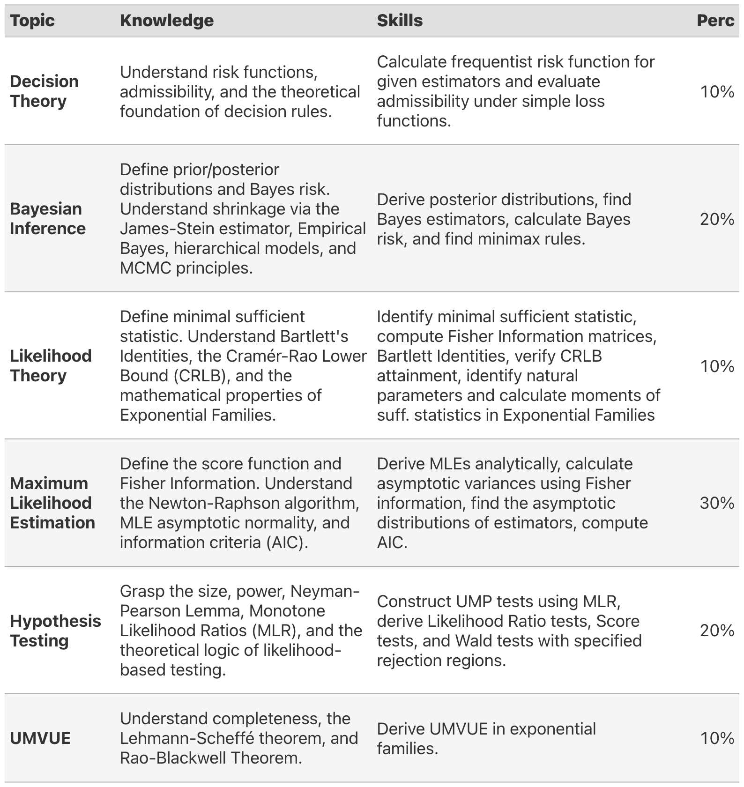

## Description

This course presents a rigorous theoretical treatment of statistical inference, offering a comparative analysis of frequentist and Bayesian paradigms. The curriculum explores several core areas of statistical theory, including Likelihood theory (Sufficient Statistic, Bartlett's Identities, Cramér-Rao Lower Bound, Exponential Families) and the mechanics of Maximum Likelihood Estimation (Score, Fisher Information, Newton-Raphson Methods, Asymptotics of Maximum Likelihood Estimators, Akaike Information Criteria, Deep Learning). The course also covers hypothesis testing and optimal point estimation through the lens of the Likelihood ratio test (Neyman-Pearson Lemma, Monotone Likelihood Test, Likelihood-based Tests) and UMVUE (Complete Statistic, Uniformly Minimum Variance Unbiased Estimators/Tests). Additionally, the syllabus addresses foundational concepts in Decision theory (Risk Function, Minimaxity Theorem) and provides a comprehensive treatment of Bayesian inference (Posterior, Bayes Rules, Bayes Risk, Minimax Rules, James-Stein Estimator, Empirical Bayes, Hierarchical Bayesian, MCMC, Case Study).

**Prerequisite(s):** STAT 342. 

This course requires a strong command of multivariate calculus, alongside a rigorous foundation in intermediate probability theory including asymptotic theorey for probability. Students should also possess prior exposure to applied statistical methods and familiar with basic statistical concepts such as standard error, p-value, and confidence internal.

## Instructor
* [Longhai Li](https://longhaisk.github.io), Professor
* Department of Mathematics and Statistics, University of Saskatchewan
* Email: longhai.li@usask.ca.

## Times and Places
* **Lectures:** TTH 11:30-12:50, MCLN 42.1
* **Office Hours:** TBA with Students
* **No lab**

## Textbook and Course Materials

* [The course page](https://longhaisk.github.io/teaching/stat850/) contains the links to my lecture notes and assingments.

* **Recommended Text:** 

  Young G. A. & R. L. Smith, *Essentials of Statistical Inference*, Cambridge University Press, 2005. 


## Tentative Schedule

```{r}
#| echo: false
#| message: false
#| warning: false
#| out-width: "100%"
#| out-extra: "style='width: 100% !important;'"

library(gt)
library(dplyr)
library(tibble)

# 1. SETUP DATES
start_date <- as.Date("2027-01-06")
break_date <- as.Date("2027-02-15")
end_date   <- as.Date("2027-04-08")

# Helper function to find the Monday of the week for any given date
get_monday <- function(d) { d - as.numeric(format(d, "%u")) + 1 }

first_monday <- get_monday(start_date)
break_monday <- get_monday(break_date)
last_monday  <- get_monday(end_date)

# Generate all Mondays for the term
term_dates <- seq(from = first_monday, to = last_monday, by = "week")

# 2. DEFINE COURSE TOPICS & TASKS (IN ORDER)
# These will be sequentially filled into any week that is NOT a break week.
content_list <- tribble(
  ~Topic,                                                                                ~Base_Task,
  "1. Introduction: Likelihood Function, and MLE",                                       "",
  "2. Likelihood Theory: Sufficient Statistic",                                          "",
  "3. Likelihood Theory: Bartlett's Identities, CR Lower Bound",                         "",
  "3. Likelihood Theory: Exponential Families",                                          "",
  "4. Maximum Likelihood Estimation: Score, Fisher Information, Newton-Raphson Methods", "",
  "4. Maximum Likelihood Estimation: Asymptotics of MLE, AIC, Deep Learning",            "**Assignment 1 due**",
  "5. Hypothesis Testing: NP Lemma, Monotone Likelihood Test, Likelihood-based Tests",   "**Midterm (during class)**",
  "6. Uniformly Minimum Variance Unbiased Tests: Complete Statistic, UMVUE",             "",
  "7. Decision Theory: Risk, Minimaxity Theorem",                                        "**Assignment 2 due**",
  "7. Bayesian Inference: Posterior, Bayes Rules, Bayes Risk",                           "",
  "7. Bayesian Inference: Minimax Rules, James-Stein Estimator",                         "",
  "7. Bayesian Inference: Empirical Bayes, Hierarchical Bayesian, MCMC, Case Study",     "",
  "Review",                                                                              "**Assignment 3 due**"
)

# 3. BUILD THE SCHEDULE DYNAMICALLY
schedule_list <- list()
acad_counter <- 1 # Tracks which topic we are on

for (i in seq_along(term_dates)) {
  curr_date <- term_dates[i]
  
  if (curr_date == break_monday) {
    # --- Reading Week ---
    schedule_list[[i]] <- data.frame(
      Date_Val  = curr_date,
      Date      = format(curr_date, "%b %d"),
      Acad_Week = "N/A",
      Topic     = "—",
      Task      = "**Reading Week – No classes**",
      stringsAsFactors = FALSE
    )
  } else {
    # --- Regular Academic Week ---
    # Fetch the next topic, or print "TBD" if there are more weeks than topics
    curr_topic <- ifelse(acad_counter <= nrow(content_list), content_list$Topic[acad_counter], "TBD")
    curr_task  <- ifelse(acad_counter <= nrow(content_list), content_list$Base_Task[acad_counter], "")
    
    schedule_list[[i]] <- data.frame(
      Date_Val  = curr_date,
      Date      = format(curr_date, "%b %d"),
      Acad_Week = as.character(acad_counter),
      Topic     = curr_topic,
      Task      = curr_task,
      stringsAsFactors = FALSE
    )
    
    # Increment the topic counter
    acad_counter <- acad_counter + 1
  }
}

# Combine into a single dataframe
schedule_data <- do.call(rbind, schedule_list)

# 4. APPEND START & END TASKS
# Find the start week and append the start date note
start_idx <- which(schedule_data$Date_Val == first_monday)
if (length(start_idx) > 0) {
  prefix <- ifelse(schedule_data$Task[start_idx] == "", "", paste0(schedule_data$Task[start_idx], "<br>"))
  schedule_data$Task[start_idx] <- paste0(prefix, "**Course Starts (", format(start_date, "%b %d"), ")**")
}

# Find the end week and append the end date note
end_idx <- which(schedule_data$Date_Val == last_monday)
if (length(end_idx) > 0) {
  prefix <- ifelse(schedule_data$Task[end_idx] == "", "", paste0(schedule_data$Task[end_idx], "<br>"))
  schedule_data$Task[end_idx] <- paste0(prefix, "**Course Ends (", format(end_date, "%b %d"), ")**")
}

# Save index for highlighting the Reading Week
break_idx <- which(schedule_data$Date_Val == break_monday)

# Clean up the temporary internal date column
schedule_data$Date_Val <- NULL

# 5. CREATE THE GT TABLE
gt_tbl <- schedule_data %>%
  gt() %>%
  
  # Format column labels
  cols_label(
    Acad_Week = md("**Academic Week**"),
    Date      = md("**Date**"),
    Topic     = md("**Topic**"),
    Task      = md("**Task**")
  ) %>%
  
  # Process markdown in the Task column
  fmt_markdown(columns = c(Task)) %>%
  
  # Alignment
  cols_align(align = "center", columns = c(Acad_Week)) %>%
  cols_align(align = "left", columns = c(Date, Topic, Task)) %>%
  
  # Column widths
  cols_width(
    Acad_Week ~ pct(15),
    Date      ~ pct(10),
    Topic     ~ pct(50),
    Task      ~ pct(25)
  ) %>%
  
  opt_row_striping() %>%
  
  # Table Styling
  tab_options(
    table_body.hlines.style = "solid",
    table_body.vlines.style = "solid",
    table_body.hlines.color = "#E0E0E0",
    
    column_labels.vlines.style = "solid",
    column_labels.border.top.style = "solid",
    column_labels.border.bottom.style = "solid",
    column_labels.background.color = "#F0F0F0",
    
    table.border.top.style = "solid",
    table.border.bottom.style = "solid",
    table.font.size = px(13)
  ) %>%
  
  # Highlight the dynamically found break_date row
  tab_style(
    style = list(
      cell_fill(color = "#d1e7dd"),
      cell_text(weight = "bold", style = "italic")
    ),
    locations = cells_body(rows = break_idx)
  )

gt_tbl
```

:::{.callout-important}
The schedule may change depending on the course pace. The exact assignment and test dates  are given on Canvas. 
:::


## Learning Outcomes 

After completing this course, students are expected to grasp the following knowledges and skills:

```{r}
#| echo: false
#| message: false
library(gt)
library(dplyr)

# Constructing the dataframe with updated order
final_guide <- data.frame(
  Topic = c(
    "Likelihood Theory",
    "Maximum Likelihood Estimation",
    "Hypothesis Testing",
    "UMVUE",
    "Decision Theory",
    "Bayesian Inference"
  ),
  Knowledge = c(
    "Define minimal sufficient statistic. Understand Bartlett's Identities, the Cramér-Rao Lower Bound (CRLB), and the mathematical properties of Exponential Families.",
    "Define the score function and Fisher Information. Understand the Newton-Raphson algorithm, MLE asymptotic normality, and information criteria (AIC).",
    "Grasp the size, power,  Neyman-Pearson Lemma, Monotone Likelihood Ratios (MLR), and the theoretical logic of likelihood-based testing.",
    "Understand completeness, the Lehmann-Scheffé theorem, and Rao-Blackwell Theorem.",
    "Understand risk functions, admissibility, and the theoretical foundation of decision rules.",
    "Define prior/posterior distributions and Bayes risk. Understand shrinkage via the James-Stein estimator, Empirical Bayes, hierarchical models, and MCMC principles."
  ),
  Skills = c(
    "Identify minimal sufficient statistic, compute Fisher Information matrices, Bartlett Identities, verify CRLB attainment,  identify natural parameters and calculate moments of suff. statistics in Exponential Families",
    "Derive MLEs analytically, calculate asymptotic variances using Fisher information, find the asymptotic distributions of estimators, compute AIC. ",
    "Construct UMP tests using MLR, derive Likelihood Ratio tests, Score tests, and Wald tests with specified rejection regions.",
    "Derive UMVUE in exponential families.",
    "Calculate frequentist risk function for given estimators and evaluate admissibility under simple loss functions.",
    "Derive posterior distributions, find Bayes estimators, calculate Bayes risk, and find minimax rules."
  ),
  Percentages = c("10%", "30%", "20%", "10%", "10%", "20%")
)

outcome_tbl <- final_guide %>%
  gt() %>%
  cols_label(
    Topic = md("**Topic**"),
    Knowledge = md("**Knowledge**"),
    Skills = md("**Skills**"),
    Percentages = md("**Perc**")
  ) %>%
  tab_style(
    style = cell_text(weight = "bold"),
    locations = cells_body(columns = Topic)
  ) %>%
  opt_row_striping() %>%
  tab_options(
    table.width = pct(100),
    column_labels.background.color = "#E0E0E0",
    column_labels.font.weight = "bold",
    table.font.size = px(12),           # Slightly larger base font
    data_row.padding = px(5),          # Forces more row height
    row.striping.background_color = "#F5F5F5",
    table_body.hlines.color = "#B0B0B0", 
    table_body.hlines.width = px(1)
  ) %>%
  cols_width(
    Topic ~ pct(15),
    Knowledge ~ pct(35),
    Skills ~ pct(40),
    Percentages ~ pct(10)
  )

outcome_tbl
# # Save with a zoom factor
# if (!knitr::is_html_output()) {
#   gtsave(outcome_tbl, "outcome_snapshot.png", vwidth = 800) 
#   
# } else {
#   outcome_tbl
# }

```

## Evaluation

### Grading Scheme

**3 Assignments: 3 x 10%, 1 Term Test: 20%, 1 Final Exam: 50%.**


### Assignments and Tests
**Assignment questions are released in the one-drive folder**. You will submit your solutions via Canvas. **If you miss an assignment without proper excuse, the weight will NOT be shifted to the final.** Undergraduate students will be assigned with different assignments and tests.

### Assignments

* I will accept late assignments only for three (3) days beyond the due date. The penalty for your delay is 10 percentage points per day of lateness from the value of the assignment (including weekends). **Extensions are only granted in rare instances (notably as a result of family or medical emergencies) and upon receipt of adequate documentation/proof.**
* Answer the questions in the order they appear in the assignment. Neatness is important.
* Solutions to problems are to be included. Hence, simple answers without work will receive few (or no!) marks.
* Most problems in statistics have a “real-life” basis. Hence, solutions should include not only numerical solutions but also a statement as to what the numbers say about the problem.
* The work handed in must not be an exact duplicate of others.
* Submitting Assignments: The assignment can be typed and/or handwritten. Save your assignment as **one PDF file** (for handwritten assignments, feel free to take a picture/scan of your work and save it as one PDF file). Upload the **PDF file** as an assignment submission in Canvas.
* More details will be provided ahead of each assignment.
* Due Date: See Course Schedule.

### Midterm
* The midterm is given in class period.
* Midterms must be written on the dates scheduled. Students must do midterms completely on their own. More details (including syllabus) will be provided ahead of each midterm.
* Type: Short-answer questions, problem-solving, open-book.
* Calculator: A scientific calculator is allowed.
* Make-up exam will not be given. If you miss an exam for a legitimate reason (e.g., illness, emergency) and notify me within 48 hours of the scheduled exam, the weight of the missed exam will be transferred to the final exam.

### Final Exam
* Scheduling: Final examinations may be scheduled at any time during the examination period; students should therefore avoid making prior travel, employment, or other commitments for this period. If a student is unable to write an exam through no fault of their own for medical or other valid reasons, documentation must be provided and an opportunity to write the missed exam may be given. Students are encouraged to review all examination policies and procedures: [http://students.usask.ca/academics/exams.php](http://students.usask.ca/academics/exams.php).
* The final exam will cover material of the entire course. More details will be provided ahead of the exam.
* Length: 3-hour in-person exam.
* Type: Short-answer questions, problem-solving, open-book.

### Criteria That Must Be Met to Pass
The **final exam is a required component of the course**. Students must complete the final exam in order to be eligible to receive a passing grade in this class.

## Attendance Expectation
Attendance is highly correlated with student performance. While a syllabus and suggested readings are provided, it is not an adequate substitute for attending class. Your **attendance is highly recommended** but not required, and you will not be graded on your attendance.


## Recording of the Course
Recording of the lectures will only be allowed in certain circumstances. Please see the instructor for information on how to receive approval. In general, there will be no videos available for in-person lectures. Therefore, **attendance is strongly recommended**.

## Use of Generative AI and Electronic Devices

1. AI for Learning vs. Assessment. Students are free (and encouraged) to use Generative AI tools as a study aid to understand course concepts, debug code, or explain complex theorems. However, **all submitted work for assignments must be your own.** You must write your own solutions. Directly copying text, derivations, or code from an AI tool and submitting it as your own may receive a **severe penalty** (up to receiving a 0% on the assignment.
  
2. Electronic Devices During Tests. All term tests and the final exam are **Open Book**, meaning you may bring printed notes, textbooks, and lecture slides.
  
   - **No Electronic Devices:** You are **NOT allowed** to use laptops, tablets, smartwatches, or any other electronic devices during the exam.
    
   - **Phone Exception:** You are permitted to bring a smartphone, but it must remain stowed away during the writing period. It may **only** be used at the very end of the exam for the specific purpose of taking photos of your answer sheets for submission (if required). Using the phone for any other reason during the exam will be treated as academic misconduct.


    