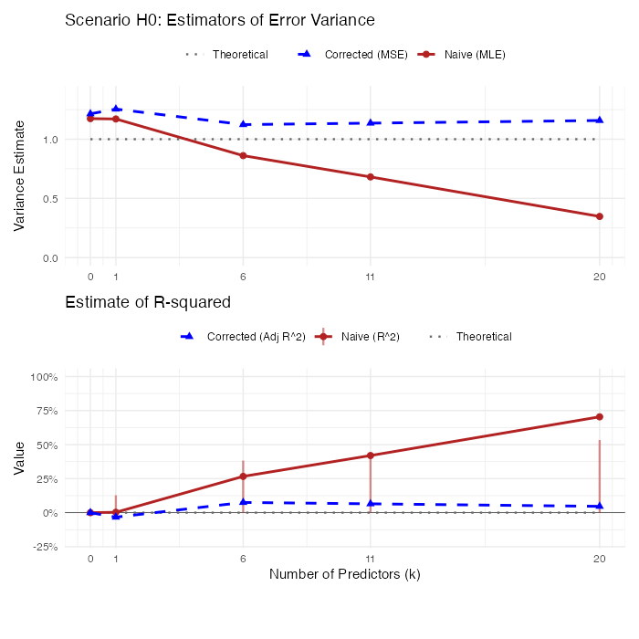
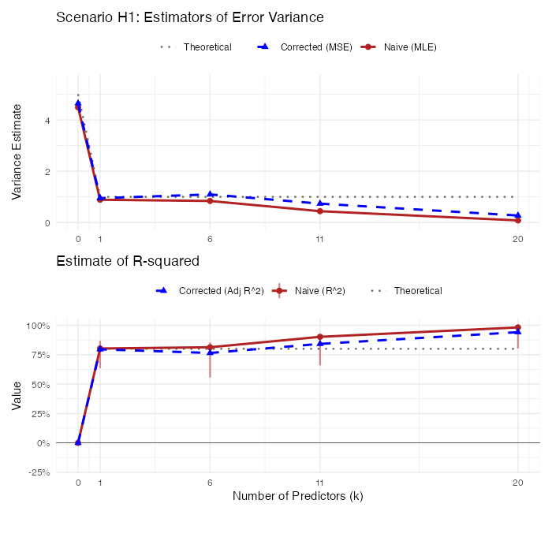

# Inference for A Multiple Linear Regression Model

## Linear Models and Least Square Estimator

### Assumptions in Linear Models

Suppose that on a random sample of $n$ units (patients, animals, trees, etc.) we observe a response variable $Y$ and explanatory variables $X_{1},...,X_{k}$. Our data are then $(y_{i},x_{i1},...,x_{ik})$, $i=1,...,n$, or in vector/matrix form $y, x_{1},...,x_{k}$ where $y=(y_{1},...,y_{n})$ and $x_{j}=(x_{1j},...,x_{nj})^{T}$ or $y, X$ where $X=(x_{1},...,x_{k})$.

Either by design or by conditioning on their observed values, $x_{1},...,x_{k}$ are regarded as vectors of known constants. The linear model in its classical form makes the following assumptions:

**Assumptions on Linear Models**

* **A1. (Additive Error)**
$y=\mu+e$ where $e=(e_{1},...,e_{n})^{T}$ is an unobserved random vector with $E(e)=0$. This implies that $\mu=E(y)$ is the unknown mean of $y$.

* **A2. (Linearity)**
$\mu=\beta_{1}x_{1}+\cdot\cdot\cdot+\beta_{k}x_{k}=X\beta$ where $\beta_{1},...,\beta_{k}$ are unknown parameters. This assumption says that $E(y)=\mu\in\text{Col}(X)$ (lies in the column space of $X$); i.e., it is a linear combination of explanatory vectors $x_{1},...,x_{k}$ with coefficients the unknown parameters in $\beta=(\beta_{1},...,\beta_{k})^{T}$. Note that it is linear in $\beta_{1},...,\beta_{k}$, not necessarily in the $x$'s.

* **A3. (Independence)**
$e_{1},...,e_{n}$ are independent random variables (and therefore so are $y_{1},...,y_{n})$.

* **A4. (Homoscedasticity)**
$e_{1},...,e_{n}$ all have the same variance $\sigma^{2}$; that is, $\text{Var}(e_{1})=\cdot\cdot\cdot=\text{Var}(e_{n})=\sigma^{2}$ which implies $\text{Var}(y_{1})=\cdot\cdot\cdot=\text{Var}(y_{n})=\sigma^{2}$.

* **A5. (Normality)**
$e\sim N_{n}(0,\sigma^{2}I_{n})$.


### Matrix Formulation

The model can be written algebraically as:
$$y_{i}=\beta_{0}+\beta_{1}x_{i1}+\beta_{2}x_{i2}+\cdot\cdot\cdot+\beta_{k}x_{ik}, \quad i=1,...,n$$

Or in matrix notation:
$$
\begin{pmatrix}
y_{1}\\
y_{2}\\
\vdots\\
y_{n}
\end{pmatrix}
=
\begin{pmatrix}
1 & x_{11} & x_{12} & \cdot\cdot\cdot & x_{1k}\\
1 & x_{21} & x_{22} & \cdot\cdot\cdot & x_{2k}\\
\vdots & \vdots & \vdots & \vdots & \vdots\\
1 & x_{n1} & x_{n2} & \cdot\cdot\cdot & x_{nk}
\end{pmatrix}
\begin{pmatrix}
\beta_{0}\\
\beta_{1}\\
\vdots\\
\beta_{k}
\end{pmatrix}
+
\begin{pmatrix}
e_{1}\\
e_{2}\\
\vdots\\
e_{n}
\end{pmatrix}
$$

This is expressed compactly as:
$$y=X\beta+e$$
where $X$ is the design matrix, and $e \sim N_n(0, \sigma^2 I)$. Alternatively:
$$y=\beta_{0}j_{n}+\beta_{1}x_{1}+\cdot\cdot\cdot+\beta_{k}x_{k}+e$$

Taken together, all five assumptions can be stated more succinctly as:
$$y\sim N_{n}(X\beta,\sigma^{2}I)$$
with the mean vector $\mu_{y}=X\beta\in \text{Col}(X)$.

:::{.callout-important}

### Coefficients and Variance of Reduced Models
The effect of a parameter and the magnitude of the error variance depend upon what other explanatory variables are present in the model. For example, the coefficients $\beta_{0}, \beta_{1}$ and error standard deviation $\sigma$ in the model:
$$y=\beta_{0}j_{n}+\beta_{1}x_{1}+\beta_{2}x_{2}+e, \quad \text{Var}(e) = \sigma^2 I$$
will typically be different than $\beta_{0}^{*}, \beta_{1}^{*}$ and $\sigma^*$ in the model:
$$y=\beta_{0}^{*}j_{n}+\beta_{1}^{*}x_{1}+e^*, \quad \text{Var}(e^*) = (\sigma^*)^2 I$$
In this context, $\beta_0^*$ and $\beta_1^*$ are the population-projected coefficients of the full model. Furthermore, $\sigma^*$ will typically be larger than $\sigma$, as the error term $e^*$ absorbs the variation previously explained by $x_2$.

:::

::: {.callout-important}
We will first consider the case that $\text{rank}(X)=k+1$.

:::

### Least Squares Estimator of $\beta$ and Fitted Value $\hat Y$

::: {#def-least-squares name="Least Squares Estimator"}
The **Least Squares Estimator (LSE)** of $\beta$, denoted as $\hat{\beta}$, is the vector that minimizes the Sum of Squared Errors (SSE), which measures the discrepancy between the observed responses $y$ and the fitted values $X\hat{\beta}$.
$$
Q(\beta) = \sum_{i=1}^n (y_i - x_i^T \beta)^2 = (y - X\beta)'(y - X\beta)
$$

:::

::: {#thm-leastsquare}

### Least Squares Estimator

Consider the linear model $y = X\beta + e$, where $X$ is of full column rank. The Ordinary Least Squares (OLS) estimator $\hat{\beta}$ is given by the closed-form solution:

$$\hat{\beta} = (X'X)^{-1}X'y$$

Consequently, the vector of fitted values $\hat{y}$ is the orthogonal projection of $y$ onto $\text{Col}(X)$:

$$\hat{y} = X\hat{\beta} = Hy$$

where $H = X(X'X)^{-1}X'$ is the orthogonal projection matrix (hat matrix).

:::

::: {.proof}
The derivation relies on the geometry of orthogonal projections.

1. Obtaining the Fitted Values $\hat{y}$

In the linear model, the systematic component $E[y]$ is constrained to lie in the column space of $X$, denoted as $\text{Col}(X)$. We seek the vector in $\text{Col}(X)$ that is "closest" to the observed data $y$. This vector is the **orthogonal projection** of $y$ onto $\text{Col}(X)$, denoted as $\hat{y}$. Using the projection matrix $H = X(X'X)^{-1}X'$, we have:

$$\hat{y} = Hy = X(X'X)^{-1}X' y$$

2. Obtaining $\hat{\beta}$ by Solving $X\beta = \hat{y}$

Since $\hat{y}$ is a projection onto $\text{Col}(X)$, the system $X\hat{\beta} = \hat{y}$ is consistent. To isolate $\hat{\beta}$, we pre-multiply both sides by $(X'X)^{-1}X'$:

$$
\begin{aligned}
(X'X)^{-1}X' (X\hat{\beta}) &= (X'X)^{-1}X' \hat{y} \\
\underbrace{(X'X)^{-1}(X'X)}_{I} \hat{\beta} &= (X'X)^{-1}X' \hat{y} \\
\hat{\beta} &= (X'X)^{-1}X' \hat{y}
\end{aligned}
$$

Finally, we express the estimator in terms of the observed $y$. Because $\hat{y}$ is an orthogonal projection, the residual $y - \hat{y}$ is orthogonal to the columns of $X$, implying $X'\hat{y} = X'y$. Substituting this into the equation above yields the result:

$$\hat{\beta} = (X'X)^{-1}X'y$$

:::


### Properties of the Estimator $\hat \beta$

::: {#thm-unbiased name="Unbiasedness of $\hat \beta$"}
If $E(y)=X\beta$, then $\hat{\beta}$ is an unbiased estimator for $\beta$.

:::

::: {.proof}
$$
\begin{aligned}
E(\hat{\beta}) &= E[(X^{\prime}X)^{-1}X^{\prime}y] \\
&= (X^{\prime}X)^{-1}X^{\prime}E(y) \quad \text{[using linearity of expectation]} \\
&= (X^{\prime}X)^{-1}X^{\prime}X\beta \\
&= \beta
\end{aligned}
$$

:::

::: {#thm-covariance name="Variance of $\hat \beta$"}
If $\text{Var}(y)=\sigma^{2}I$, the covariance matrix for $\hat{\beta}$ is given by $\sigma^{2}(X^{\prime}X)^{-1}$.

:::

::: {.proof}
$$
\begin{aligned}
\text{Var}(\hat{\beta}) &= \text{Var}[(X^{\prime}X)^{-1}X^{\prime}y] \\
&= (X^{\prime}X)^{-1}X^{\prime}\text{Var}(y)[(X^{\prime}X)^{-1}X^{\prime}]^{\prime} \quad \text{[using } \text{Var}(Ay) = A \text{Var}(y) A'] \\
&= (X^{\prime}X)^{-1}X^{\prime}(\sigma^{2}I)X(X^{\prime}X)^{-1} \\
&= \sigma^{2}(X^{\prime}X)^{-1}X^{\prime}X(X^{\prime}X)^{-1} \\
&= \sigma^{2}(X^{\prime}X)^{-1}
\end{aligned}
$$

:::

**Note:** These theorems require no assumption of normality.


## Best Linear Unbiased Estimator (BLUE)

::: {#thm-gauss-markov name="Gauss-Markov Theorem"}
If $E(y)=X\beta$ and $\text{Var}(y)=\sigma^{2}I$, the least-squares estimators $\hat{\beta}_{j}, j=0,1,...,k$ have minimum variance among all linear unbiased estimators.

:::

::: {.proof}
We consider a linear estimator $Ay$ of $\beta$ and seek the matrix $A$ for which $Ay$ is a minimum variance unbiased estimator.

1. Unbiasedness Condition:

In order for $Ay$ to be an unbiased estimator of $\beta$, we must have $E(Ay)=\beta$. Using the assumption $E(y)=X\beta$, this is expressed as:
$$E(Ay) = A E(y) = AX\beta = \beta$$
which implies the condition $AX=I_{k+1}$ since the relationship must hold for any $\beta$.

2. Minimizing Variance:

The covariance matrix for the estimator $Ay$ is:
$$\text{Var}(Ay) = A \text{Var}(y) A' = A(\sigma^2 I) A' = \sigma^2 AA'$$
We need to choose $A$ (subject to $AX=I$) so that the diagonal elements of $AA'$ are minimized.

To relate $Ay$ to $\hat{\beta}=(X'X)^{-1}X'y$, we define $\hat{A} = (X'X)^{-1}X'$ and write $A = (A - \hat{A}) + \hat{A}$. Then:
$$AA' = [(A - \hat{A}) + \hat{A}] [(A - \hat{A}) + \hat{A}]'$$
Expanding this, the cross terms vanish because $(A - \hat{A})\hat{A}' = A\hat{A}' - \hat{A}\hat{A}'$.
Note that $\hat{A}\hat{A}' = (X'X)^{-1}X'X(X'X)^{-1} = (X'X)^{-1}$.
Also, $A\hat{A}' = A X (X'X)^{-1} = I (X'X)^{-1} = (X'X)^{-1}$ (since $AX=I$).
Thus, $(A - \hat{A})\hat{A}' = 0$.

The expansion simplifies to:
$$AA' = (A - \hat{A})(A - \hat{A})' + \hat{A}\hat{A}'$$
The matrix $(A - \hat{A})(A - \hat{A})'$ is positive semidefinite, meaning its diagonal elements are non-negative. To minimize the diagonal of $AA'$, we must set $A - \hat{A} = 0$, which implies $A = \hat{A}$.

Thus, the minimum variance estimator is:
$$Ay = (X'X)^{-1}X'y = \hat{\beta}$$

:::


### Notes on Gauss-markov

1.  **Distributional Generality:** The remarkable feature of the Gauss-Markov theorem is that it holds for *any* distribution of $y$; normality is not required. The only assumptions used are linearity ($E(y)=X\beta$) and homoscedasticity ($\text{Var}(y)=\sigma^2 I$).

2.  **Extension to All Linear Combinations:** The theorem extends beyond just the parameter vector $\beta$ to any linear combination of the parameters.

3.  **Scaling Invariance:** The predictions made by the model are invariant to the scaling of the explanatory variables.


::: {#cor-linear-combo name="BLUE for All Linear Combinations"}
If $E(y)=X\beta$ and $\text{Var}(y)=\sigma^{2}I$, the best linear unbiased estimator of the scalar $a'\beta$ is $a'\hat{\beta}$, where $\hat{\beta}$ is the least-squares estimator.

:::

::: {.proof}
Let $\tilde{\beta} = Ay$ be any other linear unbiased estimator of $\beta$. The variance of the linear combination $a'\tilde{\beta}$ is:
$$
\frac{1}{\sigma^2}\text{Var}(a'\tilde{\beta}) = \frac{1}{\sigma^2}\text{Var}(a'Ay) = a'AA'a
$$
From the proof of the Gauss-Markov theorem, we established that $AA' = (A-\hat{A})(A-\hat{A})' + (X'X)^{-1}$ where $\hat{A} = (X'X)^{-1}X'$. Substituting this into the variance equation:
$$
a'AA'a = a'(A-\hat{A})(A-\hat{A})'a + a'(X'X)^{-1}a
$$
The term $a'(A-\hat{A})(A-\hat{A})'a$ is a quadratic form with a positive semidefinite matrix, so it is always non-negative. Therefore:
$$
a'AA'a \ge a'(X'X)^{-1}a = \frac{1}{\sigma^2}\text{Var}(a'\hat{\beta})
$$
The variance is minimized when $A=\hat{A}$ (specifically when the first term is zero), proving that $a'\hat{\beta}$ has the minimum variance among all linear unbiased estimators.

:::


::: {#thm-scaling name="Scaling Explanatory Variables"}
If $x=(1,x_{1},...,x_{k})'$ and $z=(1,c_{1}x_{1},...,c_{k}x_{k})'$, then the fitted values are identical: $\hat{y} = \hat{\beta}'x = \hat{\beta}_{z}'z$.

:::

::: {.proof}
Let $D = \text{diag}(1, c_1, ..., c_k)$ such that the design matrix is transformed to $Z = XD$. The LSE for the transformed data is:
$$
\begin{aligned}
\hat{\beta}_z &= (Z'Z)^{-1}Z'y = [(XD)'(XD)]^{-1}(XD)'y \\
&= D^{-1}(X'X)^{-1}(D')^{-1}D'X'y \\
&= D^{-1}(X'X)^{-1}X'y = D^{-1}\hat{\beta}
\end{aligned}
$$
. Then, the prediction is:
$$
\hat{\beta}_z' z = (D^{-1}\hat{\beta})' (Dx) = \hat{\beta}' (D^{-1})' D x = \hat{\beta}'x
$$
.

:::

### Limitations: Restriction to Unbiased Estimators 

It is crucial to recognize that the Gauss-Markov theorem only guarantees optimality within the class of **linear** and **unbiased** estimators.

* **Assumption Sensitivity:** If the assumptions of linearity ($E(y)=X\beta$) and homoscedasticity ($\text{Var}(y)=\sigma^2 I$) do not hold, $\hat{\beta}$ may be biased or may have a larger variance than other estimators.
* **Unbiasedness Constraint:** The theorem does not compare $\hat{\beta}$ to biased estimators. It is possible for a biased estimator (e.g., shrinkage estimators) to have a smaller Mean Squared Error (MSE) than the BLUE by accepting some bias to significantly reduce variance. The LSE is only "best" (minimum variance) among those estimators that satisfy the unbiasedness constraint.


## Unbiased Estimator of Error Variance

We estimate $\sigma^{2}$ by the residual mean square:

::: {#def-s2 name="Residual Variance Estimator"}
$$s^{2} = \frac{1}{n-k-1} \sum_{i=1}^{n}(y_{i}-x_{i}'\hat{\beta})^{2} = \frac{\text{SSE}}{n-k-1}$$
where $\text{SSE} = (y-X\hat{\beta})'(y-X\hat{\beta})$.

:::

Alternatively, SSE can be written as:
$$\text{SSE} = y'y - \hat{\beta}'X'y$$
This is often useful for computation ($y'y$ is the total sum of squares of the raw data).

### Unbiasedness of $s^2$

::: {#thm-unbiased-s2 name="Unbiasedness of s-squared"}
If $s^{2}$ is defined as above, and if $E(y)=X\beta$ and $\text{Var}(y)=\sigma^{2}I$, then $E(s^{2})=\sigma^{2}$.

:::

::: {.proof}
We use the Hat Matrix $H = X(X'X)^{-1}X'$, which projects $y$ onto $\text{Col}(X)$. Thus, $\hat{y} = Hy$.
The residuals are $y - \hat{y} = (I - H)y$. The Sum of Squared Errors is:
$$\text{SSE} = \|(I-H)y\|^2 = y'(I-H)'(I-H)y$$
Since $H$ is symmetric and idempotent, $(I-H)$ is also symmetric and idempotent. Thus:
$$\text{SSE} = y'(I-H)y$$

To find the expectation, we use the trace trick for quadratic forms: $E[y'Ay] = \text{tr}(A\text{Var}(y)) + E[y]'A E[y]$.
$$
\begin{aligned}
E(\text{SSE}) &= E[y'(I-H)y] \\
&= \text{tr}((I-H)\sigma^2 I) + (X\beta)'(I-H)(X\beta) \\
&= \sigma^2 \text{tr}(I-H) + \beta'X'(I-H)X\beta
\end{aligned}
$$
**Trace Term:** $\text{tr}(I_n - H) = \text{tr}(I_n) - \text{tr}(H) = n - (k+1)$, since $\text{tr}(H) = \text{tr}(X(X'X)^{-1}X') = \text{tr}((X'X)^{-1}X'X) = \text{tr}(I_{k+1}) = k+1$.

**Non-centrality Term:** Since $HX = X$, we have $(I-H)X = 0$. Therefore, the second term vanishes: $\beta'X'(I-H)X\beta = 0$.

Combining these:
$$E(\text{SSE}) = \sigma^2(n - k - 1)$$
Dividing by the degrees of freedom $(n-k-1)$, we get $E(s^2) = \sigma^2$.

:::

## Distributions Under Normality

If we add Assumption A5 ($y \sim N_n(X\beta, \sigma^2 I)$), we can derive the exact sampling distributions.

::: {#cor-cov-beta name="Estimated Covariance of Beta"}
An unbiased estimator of $\text{Cov}(\hat{\beta})$ is given by:
$$\widehat{\text{Cov}}(\hat{\beta}) = s^{2}(X'X)^{-1}$$

:::

::: {#thm-sampling-dist name="Sampling Distributions"}
Under assumptions A1-A5:

1.  $\hat{\beta} \sim N_{k+1}(\beta, \sigma^{2}(X'X)^{-1})$.
2.  $(n-k-1)s^{2}/\sigma^{2} \sim \chi^{2}(n-k-1)$.
3.  $\hat{\beta}$ and $s^{2}$ are independent.

:::

::: {.proof}
**Part (i):** Since $\hat{\beta} = (X'X)^{-1}X'y$ is a linear transformation of the normal vector $y$, it is also normally distributed. We already established its mean and variance in @thm-unbiased and @thm-covariance.

**Part (ii):** We showed $\text{SSE} = y'(I-H)y$. Since $(I-H)$ is idempotent with rank $n-k-1$, and $(I-H)X\beta = 0$, by the theory of quadratic forms in normal variables, $\text{SSE}/\sigma^2 \sim \chi^2(n-k-1)$.

**Part (iii):** $\hat{\beta}$ depends on $Hy$ (or $X'y$), while $s^2$ depends on $(I-H)y$. Since $H(I-H) = H - H^2 = 0$, the linear forms defining the estimator and the residuals are orthogonal. For normal vectors, zero covariance implies independence.

:::

## Maximum Likelihood Estimator (MLE)

::: {#thm-mle name="MLE for Linear Regression"}
If $y \sim N_n(X\beta, \sigma^2 I)$, the Maximum Likelihood Estimators (MLE) for the coefficients and the error variance are:

$$
\hat{\beta}_{\text{MLE}} = (X'X)^{-1}X'y
$$
$$
\hat{\sigma}^2_{\text{MLE},e} = \frac{\text{SSE}}{n}
$$

Similarly, under the Null Model ($y \sim N(\mu, \sigma_y^2)$), the MLE for the total variance of $y$ is:

$$
\hat{\sigma}^2_{\text{MLE},y} = \frac{\text{SST}}{n}
$$

:::

::: {.proof}
1. Derivation of Error Variance ($\hat{\sigma}^2_{\text{MLE},e}$)

The probability density function for the multivariate normal distribution $y \sim N(X\beta, \sigma^2 I)$ is:
$$f(y) = (2\pi\sigma^2)^{-n/2} \exp\left( -\frac{1}{2\sigma^2}(y - X\beta)'(y - X\beta) \right)$$

The log-likelihood function is $\ln L = \ln f(y)$:
$$\ln L(\beta, \sigma^2) = -\frac{n}{2}\ln(2\pi) - \frac{n}{2}\ln(\sigma^2) - \frac{1}{2\sigma^2}(y - X\beta)'(y - X\beta)$$

First, we maximize with respect to $\beta$. Since only the last term involves $\beta$, maximizing the likelihood is equivalent to minimizing the sum of squared errors:
$$\text{SSE}(\beta) = (y - X\beta)'(y - X\beta)$$
This yields the standard Least Squares estimator $\hat{\beta} = (X'X)^{-1}X'y$. Substituting this back into the SSE term gives the minimized sum of squares, $\text{SSE}$.

Next, we maximize with respect to the variance $\sigma^2$. Let $v = \sigma^2$. The log-likelihood becomes:
$$\ln L(v) = C - \frac{n}{2}\ln(v) - \frac{\text{SSE}}{2v}$$

Differentiating with respect to $v$:
$$\frac{\partial \ln L}{\partial v} = -\frac{n}{2v} + \frac{\text{SSE}}{2v^2}$$

Setting the derivative to zero to find the critical point:
$$-\frac{n}{2\hat{v}} + \frac{\text{SSE}}{2\hat{v}^2} = 0$$
$$\frac{n}{2\hat{v}} = \frac{\text{SSE}}{2\hat{v}^2}$$
$$n = \frac{\text{SSE}}{\hat{v}} \implies \hat{v} = \frac{\text{SSE}}{n}$$

Thus, the MLE for the error variance is:
$$\hat{\sigma}^2_{\text{MLE},e} = \frac{\text{SSE}}{n}$$

2. Derivation of Total Variance ($\hat{\sigma}^2_{\text{MLE},y}$)

Under the Null Model (intercept only), we assume $y_i \sim N(\mu, \sigma_y^2)$. The design matrix $X$ is simply a column of ones ($j_n$).
Maximizing the likelihood for $\mu$ yields the sample mean $\hat{\mu} = \bar{y}$.

The term $(y - X\beta)'(y - X\beta)$ simplifies to the Total Sum of Squares:
$$\text{SST} = \sum_{i=1}^n (y_i - \bar{y})^2$$

Following the exact same differentiation steps as above (replacing SSE with SST), the MLE for the variance of $y$ is:
$$\hat{\sigma}^2_{\text{MLE},y} = \frac{\text{SST}}{n}$$

:::

**Note:** The MLEs for variance are biased. They divide by the sample size $n$, whereas the unbiased estimators (used in standard ANOVA tables) divide by the degrees of freedom ($n-k-1$ for error, $n-1$ for total).

## Linear Models in Centered Form

Starting with the original model, let the design matrix be $X^*=[j_n, X]$, where $X$ is the $n \times p$ matrix of predictors excluding the intercept, and let the original coefficients be $\beta^* = [\beta_0^*, (\beta_1^*)^\top]^\top$. The mean vector $\mu_y = E(y)$ is:
$$\mu_y = X^*\beta^* = [j_n, X] \begin{pmatrix} \beta_0^* \\ \beta_1^* \end{pmatrix} = \beta_0^* j_n + X\beta_1^*$$

We define the centered design matrix $X_c$ as the projection of $X$ onto the orthogonal complement of the intercept space:
$$X_c = (I - P_{j_n})X = X - P_{j_n}X$$

Because $P_{j_n} = j_n(j_n^\top j_n)^{-1}j_n^\top$, the term $P_{j_n}X$ computes the column means, which we can write as $j_n\bar{x}^\top$, where $\bar{x}^\top$ is the row vector of means. Rearranging the definition gives:
$$X = j_n\bar{x}^\top + X_c$$

Substituting this expression for $X$ back into our mean vector $\mu_y$:
$$
\begin{aligned}
\mu_y &= \beta_0^* j_n + (j_n\bar{x}^\top + X_c)\beta_1^* \\
&= \beta_0^* j_n + j_n\bar{x}^\top\beta_1^* + X_c\beta_1^* \\
&= j_n(\beta_0^* + \bar{x}^\top\beta_1^*) + X_c\beta_1^*
\end{aligned}
$$

By defining the parameters of the centered model as $\alpha = \beta_0^* + \bar{x}^\top\beta_1^*$ and $\beta_1 = \beta_1^*$, the equation simplifies cleanly to:
$$\mu_y = \alpha j_n + X_c\beta_1 = [j_n, X_c]\begin{pmatrix}\alpha\\\beta_1\end{pmatrix}$$

Adding the error term, the full centered model is:
$$y = \mu_y + \epsilon = j_n\alpha + X_c\beta_1 + \epsilon$$

**Orthogonality of $j_n$ and $X_c$**

By construction, $X_c$ is orthogonal to $j_n$. This is quickly proven using the properties of the idempotent projection matrix $P_{j_n}$:
$$j_n^\top X_c = j_n^\top(I - P_{j_n})X = (j_n^\top - j_n^\top P_{j_n})X = (j_n^\top - j_n^\top)X = 0$$

**Orthogonal Projections of the Mean Vector**

Because $j_n$ and $X_c$ are strictly orthogonal, projecting $\mu_y$ onto their respective column spaces completely isolates their components:
$$
\boxed{P_{j_n}\mu_y = P_{j_n}(j_n\alpha + X_c\beta_1) = j_n\alpha + 0 = \alpha j_n}
$$
$$
\boxed{P_{X_c}\mu_y = P_{X_c}(j_n\alpha + X_c\beta_1) = 0 + X_c\beta_1 = X_c\beta_1}
$$

## Least Squares Estimates for Linear Models in Centered Form

Because the column space of the intercept $j_n$ is strictly orthogonal to the column space of $X_c$, the total projection of $y$ onto the combined column space spanned by $[j_n, X_c]$ decomposes into the sum of the independent orthogonal projections onto these two subspaces.

Let $\hat{y}_0$ denote the projection of $y$ onto $j_n$, and $\hat{y}_1$ denote the projection of $y$ onto $X_c$:
$$\hat{y}_0 = P_{j_n}y$$
$$\hat{y}_1 = P_{X_c}y$$

We can express the total fitted values $\hat{y}$ as the sum of these orthogonal projections:
$$\boxed{\hat{y} = \hat{y}_0 + \hat{y}_1 = P_{j_n}y + P_{X_c}y}$$

We also know that the fitted values equal the linear combination of the column vectors weighted by their least squares estimators:
$$\hat{y} = j_n\hat{\alpha} + X_c\hat{\beta}_1$$

Because the subspaces are orthogonal, this vector decomposition is unique, allowing us to equate the respective components:
$$\boxed{\hat{y}_0 = P_{j_n}y=j_n\hat{\alpha}}$$
$$\boxed{\hat{y}_1 = P_{X_c}y=X_c\hat{\beta}_1}$$


By pre-multiplying the first equation by $(j_n^\top j_n)^{-1}j_n^\top$ and the second by $(X_c^\top X_c)^{-1}X_c^\top$, or by looking at the expressions of $\hat y_0$ and $\hat y_1$, we easily isolate the least squares estimators:

$$\boxed{\hat{\alpha} = (j_n^\top j_n)^{-1}j_n^\top y = \bar{y}}$$
(The sample mean of $y$)

$$\boxed{\hat{\beta}_{1} = (X_c^\top X_c)^{-1}X_c^\top y = S_{xx}^{-1}S_{xy}}$$
(Using the sample covariance matrix notations)


Recovering the original intercept:
$$\hat{\beta}_0^* = \hat{\alpha} - \bar{x}^\top\hat{\beta}_1$$

```{r}

# 1. Define the True Data-Generating Process
set.seed(2)
n <- 30
x <- runif(n, 10, 30)

beta_0_true <- 10
beta_1_true <- 2.5

# Generate y with random normal errors
y <- beta_0_true + beta_1_true * x + rnorm(n, mean = 0, sd = 10)

# 2. Fit the OLS Model
fit <- lm(y ~ x)
beta_0_hat <- coef(fit)[1]
beta_1_hat <- coef(fit)[2]

# 3. Calculate the necessary means and expected/fitted values
x_bar <- mean(x)
y_bar <- mean(y)
y_true_mean <- beta_0_true + beta_1_true * x_bar

mu_y <- beta_0_true + beta_1_true * x   # True mean values
y_hat <- fitted(fit)                    # Fitted values

# 4. Create the Plot
# Expanded right margin slightly to fit the new axis label
par(mar = c(5, 4, 4, 3) + 0.1) 
plot(x, y, pch = 16, col = "gray50", 
     main = "True vs Fitted Simple Linear Regression",
     xlab = expression(x[i]), 
     ylab = expression(y[i]))

# True linear line (blue, dashed)
abline(a = beta_0_true, b = beta_1_true, col = "blue", lwd = 2, lty = 2)

# True horizontal line at beta_0 + beta_1 * x_bar (blue, dotted)
abline(h = y_true_mean, col = "blue", lwd = 2, lty = 3)

# Fitted linear line (red, solid)
abline(fit, col = "red", lwd = 2, lty = 1)

# Fitted horizontal line at \bar{y} (red, dotted)
abline(h = y_bar, col = "red", lwd = 2, lty = 3)

# Vertical line at \bar{x} (dark green, dot-dash)
abline(v = x_bar, col = "darkgreen", lwd = 2, lty = 4)

# Plot the specific points on the lines
points(x, mu_y, col = "blue", pch = 17, cex = 1.2) # Solid blue triangles for mu_y
points(x, y_hat, col = "red", pch = 15, cex = 1.2) # Solid red squares for y_hat

# ---------------------------------------------------------
# NEW: Treat true horizontal line as a centered axis (x_i - \bar{x})
# ---------------------------------------------------------
# Define nice round numbers for the centered axis ticks
xc_ticks <- seq(-10, 10, by = 5) 
x_tick_pos <- xc_ticks + x_bar

# Draw vertical tick marks crossing the true horizontal line
tick_len <- 2 # Adjust this value if ticks are too long/short vertically
segments(x0 = x_tick_pos, y0 = y_true_mean - tick_len, 
         x1 = x_tick_pos, y1 = y_true_mean + tick_len, 
         col = "blue", lwd = 2)

# Add the text values for the centered ticks just below the line
text(x = x_tick_pos, y = y_true_mean - tick_len - 2, 
     labels = xc_ticks, col = "blue", cex = 0.85, font = 2)

# Add a label for this new centered axis at the far right
text(x = max(x) + 1, y = y_true_mean + tick_len + 2, 
     labels = expression(x[i] - bar(x)), col = "blue", cex = 1)
# ---------------------------------------------------------

# 5. Add a mathematical legend
legend("topleft", 
       legend = c(
         expression("True Line: " * y == beta[0] + beta[1]*x),
         expression("True Horiz: " * y == beta[0] + beta[1]*bar(x)),
         expression("Fitted Line: " * hat(y) == hat(beta)[0] + hat(beta)[1]*x),
         expression("Fitted Horiz: " * y == bar(y)),
         expression("Vertical Line: " * x == bar(x)),
         expression("True Mean " * mu[y]),
         expression("Fitted Value " * hat(y))
       ),
       col = c("blue", "blue", "red", "red", "darkgreen", "blue", "red"),
       lty = c(2, 3, 1, 3, 4, NA, NA), 
       lwd = c(2, 2, 2, 2, 2, NA, NA),
       pch = c(NA, NA, NA, NA, NA, 17, 15),
       pt.cex = 1.2,
       bty = "n", 
       cex = 0.85) # Slightly reduced to avoid overlapping data points

```

## Decomposition of Sum of Squares and their Distributions

We partition the total variation based on the orthogonal subspaces.

::: {#def-ss-components name="Sum of Squares Components"}
The total variation is decomposed as $\text{SST} = \text{SSR} + \text{SSE}$.

1.  **Total Sum of Squares (SST):** The squared length of the centered response vector.

    $$\text{SST} = \|y - \bar{y}j_n\|^2 = \|(I - P_{j_n})y\|^2$$

2.  **Regression Sum of Squares (SSR):** The variation explained by the regressors $X_c$.

    $$\text{SSR} = \|\hat{y} - \bar{y}j_n\|^2 = \|P_{X_c}y\|^2 = \hat{\beta}_1' X_c' X_c \hat{\beta}_1$$

3.  **Sum of Squared Errors (SSE):** The residual variation.

    $$\text{SSE} = \|y - \hat{y}\|^2 = \|(I - H)y\|^2$$

:::


### 3D Visualization of Decomposition of $y$

We partition the total variation in $y$ based on the orthogonal subspaces.

1.  **Space of the Mean:** $L(j_n)$, spanned by the intercept vector $j_n$.
2.  **Space of the Regressors:** $L(X_c)$, spanned by the centered predictors $X_c$.
3.  **Error Space:** $\text{Col}(X)^\perp$, orthogonal to the model space.

The vector $y$ can be decomposed into three orthogonal components:
$$y = \bar{y}j_n + P_{X_c}y + (y - \hat{y})$$
Visually, this corresponds to projecting the vector $y$ onto three orthogonal axes.

**Interactive Visualization:**

We generate a cloud of 100 observations of $y$ from $N(\mu, \sigma=1)$ where $\mu = (5,5,0)$. The projections onto the Model Plane ($z=0$) are highlighted in **red**, and the projections onto the error axis ($z$) are in **yellow**.

```{r}
#| label: setup-3d-geometry
#| include: false

library(plotly)
library(MASS)

# --- Check Dependencies for PDF ---
if (!knitr::is_html_output()) {
  if (!requireNamespace("webshot2", quietly = TRUE)) {
    stop("Package 'webshot2' is required for PDF output. Run: install.packages('webshot2')")
  }
}

# --- 1. Data Generation Helper ---
get_data <- function(beta_effect = TRUE) {
  set.seed(123)
  n <- 50
  sigma <- 0.5
  Sigma <- diag(3) * sigma^2
  
  mu <- if(beta_effect) c(3, 4, 0) else c(3, 0, 0)
  
  data <- mvrnorm(n, mu = mu, Sigma = Sigma)
  df <- as.data.frame(data)
  colnames(df) <- c("x", "y", "z")
  
  list(df = df, mu = mu)
}

# --- 2. Plotting Helper Function ---
create_3d_plot <- function(data_list, title) {
  df <- data_list$df
  mu <- data_list$mu
  n <- nrow(df)
  
  fig <- plot_ly()
  
  # Static Floor
  x_grid <- seq(0, 7, length.out = 20)
  y_grid <- seq(-4, 8, length.out = 20)
  z_plane <- matrix(0, nrow = 20, ncol = 20)
  
  fig <- fig %>% add_surface(
    x = x_grid, y = y_grid, z = z_plane,
    opacity = 0.3, colorscale = list(c(0, 1), c("steelblue", "steelblue")),
    showscale = FALSE, name = 'Model Space'
  )
  
  # Floor Projections
  fig <- fig %>% add_trace(
    data = df, type = 'scatter3d', mode = 'markers',
    x = ~x, y = ~y, z = rep(0, n),
    marker = list(size = 4, color = 'red', symbol = 'diamond', opacity = 0.8),
    name = 'Proj on Floor'
  )
  
  # Data Cloud
  fig <- fig %>% add_trace(
    data = df, type = 'scatter3d', mode = 'markers',
    x = ~x, y = ~y, z = ~z,
    marker = list(size = 4, color = 'black', symbol = 'circle', opacity = 0.6),
    name = 'Data Cloud'
  )
  
  # Axis Projections
  fig <- fig %>% add_trace(
    data = df, type = 'scatter3d', mode = 'markers',
    x = ~x, y = rep(0, n), z = rep(0, n),
    marker = list(size = 4, color = 'blue', symbol = 'circle-open', opacity = 0.6),
    name = 'Proj L(jn)'
  )
  
  fig <- fig %>% add_trace(
    data = df, type = 'scatter3d', mode = 'markers',
    x = rep(0, n), y = ~y, z = rep(0, n),
    marker = list(size = 4, color = 'green', symbol = 'circle-open', opacity = 0.6),
    name = 'Proj L(Xc)'
  )
  
  fig <- fig %>% add_trace(
    data = df, type = 'scatter3d', mode = 'markers',
    x = rep(0, n), y = rep(0, n), z = ~z,
    marker = list(size = 4, color = 'gold', symbol = 'circle-open', opacity = 0.8),
    name = 'Error'
  )
  
  # Vectors
  fig <- fig %>% add_trace(
    type = 'scatter3d', mode = 'lines',
    x = c(0, mu[1]), y = c(0, mu[2]), z = c(0, 0),
    line = list(color = 'black', width = 6),
    name = 'Mean Vector'
  )
  
  # Guide Lines
  fig <- fig %>% add_trace(
    type = 'scatter3d', mode = 'lines',
    x = c(mu[1], mu[1]), y = c(mu[2], 0), z = c(0, 0),
    line = list(color = 'blue', width = 4, dash = 'dash'),
    name = 'Link to X'
  )
  
  fig <- fig %>% add_trace(
    type = 'scatter3d', mode = 'lines',
    x = c(mu[1], 0), y = c(mu[2], mu[2]), z = c(0, 0),
    line = list(color = 'green', width = 4, dash = 'dash'),
    name = 'Link to Y'
  )
  
  # Layout
  fig <- fig %>% layout(
    title = title,
    scene = list(
      xaxis = list(title = "L(j<sub>n</sub>)", range = c(0, 8)),
      yaxis = list(title = "L(X<sub>c</sub>)", range = c(-4, 8)),
      zaxis = list(title = "Col(X)<sup>&perp;</sup>", range = c(-4, 4)),
      aspectmode = "cube",
      camera = list(eye = list(x = 1.6, y = 1.6, z = 0.6))
    ),
    margin = list(l = 0, r = 0, b = 0, t = 30), 
    showlegend = FALSE
  )
  
  return(fig)
}

# --- 3. Output Logic Helper (HTML vs PDF) ---
render_3d <- function(fig, filename) {
  if (knitr::is_html_output()) {
    # --- HTML Output: Return Interactive Widget ---
    return(fig)
    
  } else {
    # --- PDF/Typst Output: Generate Static PNG ---
    dir.create("figs", showWarnings = FALSE)
    img_path <- file.path("figs", filename)
    
    # Use plotly's native export (relies on python-kaleido)
    # This avoids launching Chrome/Webshot
    tryCatch({
      plotly::save_image(fig, file = img_path, width = 1500, height = 1000)
    }, error = function(e) {
      warning("Plotly export failed. Ensure 'kaleido' is installed in your Python environment.\nError: ", e$message)
    })
    
    # Check if the image was created successfully
    if (file.exists(img_path)) {
      knitr::include_graphics(img_path)
    } else {
      # Fallback empty plot so the document build doesn't crash
      plot(1, 1, type="n", axes=FALSE, xlab="", ylab="")
      text(1, 1, "Error: Static image failed.\n(Missing kaleido?)")
    }
  }
}

```

::: {.panel-tabset}

#### Effect Exists (signal){.unnumbered}

```{r}
#| echo: false
#| message: false
#| warning: false
#| out-width: "100%"
#| fig-cap: "Scenario 1: Significant regression effect ($\\beta_1 \\not= 0$). The mean vector projects significantly onto the predictor space."

data_A <- get_data(beta_effect = TRUE)
fig_A  <- create_3d_plot(data_A, "Scenario A: Effect Exists")
render_3d(fig_A, "geometry-3d-signal.png")

```

#### No Effect (noise){.unnumbered}

```{r}
#| echo: false
#| message: false
#| warning: false
#| out-width: "100%"
#| fig-cap: "Scenario 2: No regression effect ($\\beta_1 = 0$). The mean vector lies purely on the intercept axis."

data_B <- get_data(beta_effect = FALSE)
fig_B  <- create_3d_plot(data_B, "Scenario B: No Effect")
render_3d(fig_B, "geometry-3d-noise.png")

```

:::

### A Diagram to Show Decomposition of Sum of Squares

The decomposition of the total variation is visualized below. The total deviation (Orange) is the vector sum of the regression deviation (Green) and the residual error (Red).

```{tikz}
%| label: fig-ss-decomposition-legend-v2
%| fig-cap: "Geometric Decomposition: SST = SSR + SSE"
%| fig-align: "center"
%| echo: false

\begin{tikzpicture}[scale=1.5, >=latex, font=\small]

  % --- Coordinates ---
  % Shifted Mean from x=2 to x=3 (Longer by 1/2)
  % Shifted Fitted/Observed by same amount (+1) to preserve triangle shape
  \coordinate (Origin) at (0,0);
  \coordinate (Mean) at (3,0);      % \bar{y}j_n (Length 3)
  \coordinate (Fitted) at (7,1.5);    % \hat{y}
  \coordinate (Observed) at (7,4.5);  % y

  % --- 1. Subspaces ---
  
  % L(j_n) Axis (Horizontal)
  \draw[->, thick, gray] (-0.5,0) -- (8.5,0) node[right, black] {$L(j_n)$};
  
  % L(X_c) Axis (Regressors)
  % Slope = 1.5 / (7-3) = 0.375. Extend to x=8 => y=1.875
  \draw[->, thick, gray] (Mean) -- (8, 1.875) node[right, black] {$L(X_c)$};

  % --- 2. Vectors ---
  
  % Mean Vector (Blue)
  \draw[thick, blue, ->] (Origin) -- (Mean) node[midway, below] {$\bar{y}j_n$};
  
  % Fitted Vector (Blue Dashed)
  \draw[dashed, blue] (Origin) -- (Fitted);
  \node[below right, blue] at (Fitted) {$\hat{y}$};

  % Observed Vector (Black)
  \draw[thick, black, ->] (Origin) -- (Observed) node[above left] {$y$};

  % --- 3. Decomposition Components ---
  
  % SSR (Green)
  \draw[ultra thick, green!60!black, ->] (Mean) -- (Fitted);
    
  % SSE (Red)
  \draw[ultra thick, red, ->] (Fitted) -- (Observed);

  % SST (Orange)
  \draw[dashed, ultra thick, orange] (Mean) -- (Observed);

  % --- 4. Perpendicular Signs ---
  
  % A. At Fitted (Orthogonality of Residuals)
  % Rotated to align with the sloped line L(Xc)
  % The angle of L(Xc) is arctan(1.5/4) approx 20.5 degrees.
  \begin{scope}[shift={(Fitted)}, rotate=20.5]
     \draw[black] (-0.25,0) -- (-0.25, 0.25) -- (0, 0.25);
  \end{scope}

  % B. At Mean (Orthogonality of Centered Regression vs Mean)
  % Angle between horizontal and L(Xc)
  \draw[black] (Mean) ++(-0.25,0) -- ++(0, 0.25) -- ++(0.2, 0); 
  % (Note: Visual approximation for the concept)

  % --- 5. Legend ---
  \node[draw, fill=white, align=left, anchor=north west] at (0.2, 4.8) {
    \textbf{Decomposition:}\\
    % Using tikz inline to draw heavy lines
    \tikz\draw[orange, line width=2.5pt] (0,0) -- (0.6,0); \textbf{ SST}: Total \\ 
    \quad $\small \|y - \bar{y}j_n\|^2$ \\[0.5em]
    
    \tikz\draw[green!60!black, line width=2.5pt] (0,0) -- (0.6,0); \textbf{ SSR}: Regression \\ 
    \quad $\small \|\hat{y} - \bar{y}j_n\|^2$ \\[0.5em]
    
    \tikz\draw[red, line width=2.5pt] (0,0) -- (0.6,0); \textbf{ SSE}: Error \\ 
    \quad $\small \|y - \hat{y}\|^2$
  };

\end{tikzpicture}

```


### Distribution of Sum of Squares

We apply the general theory of projections to the specific components defined in @def-ss-components.

::: {#thm-distribution-ss-v2}

### Distribution of Sum of Squares
Let $y \sim N(\mu, \sigma^2 I_n)$, where $\mu \in \text{Col}(X)$.
Consider the decomposition defined by the projection matrices $P_{X_c}$ and $M = I - H$.

1. **Independence**

   
   The quadratic forms $\text{SSR}$ and $\text{SSE}$ are statistically independent because the subspaces $L(X_c)$ and $\text{Col}(X)^\perp$ are orthogonal.

2. **Distribution of SSE**

   
   The scaled sum of squared errors follows a central Chi-squared distribution:
   
   $$
   \frac{\text{SSE}}{\sigma^2} = \frac{\|(I - H)y\|^2}{\sigma^2} \sim \chi^2(n-k-1)
   $$
   
   **Mean:**
   
   $$
   E[\text{SSE}] = \sigma^2(n-k-1)
   $$

3. **Distribution of SSR**

   
   The scaled regression sum of squares follows a **non-central** Chi-squared distribution:
   
   $$
   \frac{\text{SSR}}{\sigma^2} = \frac{\|P_{X_c}y\|^2}{\sigma^2} \sim \chi^2(k, \lambda)
   $$
   
   **Mean:**
   
   $$
   E[\text{SSR}] = \sigma^2 k + \|P_{X_c}\mu_y|^2
   $$

   **Non-centrality Parameter ($\lambda$):**

   $$
   \lambda = \frac{1}{\sigma^2} \|P_{X_c} \mu_y\|^2
   $$

   where 
   $$
   \boxed{\|P_{X_c} \mu_y\|^2 = \|X_c \beta_1\|^2 = (X_c \beta_1)' (X_c \beta_1) = \beta_1' X_c' X_c \beta_1}
   $$

:::


::: proof
We apply @thm-proj-dist to the specific projection matrices identified in the definitions.

* **For SSE (Error Space):**
  $\text{SSE}$ is defined by the projection matrix $P_V = I - H$.

  - **Dimension:** The rank of $(I - H)$ is $n - \text{rank}(X) = n - (k+1) = n - k - 1$.
  - **Non-centrality:** Since $\mu \in \text{Col}(X)$, the projection onto the orthogonal complement is zero: $\|(I - H)\mu\|^2 = 0$. Thus, $\lambda = 0$.
  - **Expectation:** Using Part 2 of @thm-proj-dist ($E(\|P_V y\|^2) = \sigma^2 \text{rank}(P_V) + \|P_V \mu\|^2$):
    $$ E[\text{SSE}] = \sigma^2(n-k-1) + 0 = \sigma^2(n-k-1) $$

* **For SSR (Regression Space):**
  $\text{SSR}$ is defined by the projection matrix $P_V = P_{X_c}$.

  - **Dimension:** The rank of $P_{X_c}$ is $(k+1) - 1 = k$.
  - **Non-centrality:** The projection of $\mu$ onto $L(X_c)$ is $P_{X_c}\mu_y$.
    $$ \lambda = \frac{\|P_{X_c} \mu_y\|^2}{\sigma^2}  $$

  - **Expectation:** Using Part 2 of @thm-proj-dist:
    $$ E[\text{SSR}] = \sigma^2 k + \|P_{X_c}\mu_y\|^2 $$

  This shows that while $E[\text{SSE}]$ depends only on the noise variance and sample size, $E[\text{SSR}]$ is inflated by the magnitude of the true regression signal $\|P_{X_c}\mu_y\|^2$.

:::


```{tikz}
%| label: fig-SS-stick
%| fig-cap: "Stick Diagram of Mean of SSE, SSR, and SST"
%| fig-align: "center"
%| out-extra: 'style="width: 90% !important;"'
%| echo: false
%| engine.opts:
%|   extra.preamble: "\\usetikzlibrary{decorations.pathreplacing}"

\begin{tikzpicture}[xscale=1.2, yscale=1]
  % Define coordinates
  \coordinate (O) at (0,0);
  \coordinate (SSE) at (6,0);
  \coordinate (SST) at (10,0);

  % Draw the main axis
  \draw[thick] (-0.5,0) -- (10.5,0);

  % Draw Ticks
  \foreach \x in {0, 6, 10}
    \draw[thick] (\x, 0.2) -- (\x, -0.2);

  % Labels for Ticks
  \node[above=5pt] at (O) {\textbf{0}};
  \node[above=5pt] at (SSE) {\textbf{SSE}};
  \node[above=5pt] at (SST) {\textbf{SST}};

  % Brace 1: SSE (0 to SSE)
  \draw[decorate, decoration={brace, amplitude=10pt, mirror, raise=5pt}, thick]
    (O) -- (SSE) 
    node[midway, below=20pt] {$E[\text{SSE}] = \sigma^2(n-k-1)$};

  % Brace 2: SSR (SSE to SST)
  \draw[decorate, decoration={brace, amplitude=10pt, mirror, raise=5pt}, thick]
    (SSE) -- (SST) 
    node[midway, below=20pt] {$E[\text{SSR}] = \sigma^2(k + \lambda)$};

  % Brace 3: SST (0 to SST) - Total
  \draw[decorate, decoration={brace, amplitude=10pt, mirror, raise=45pt}, thick]
    (O) -- (SST) 
    node[midway, below=60pt] {$E[\text{SST}] = \sigma^2(n-1 + \lambda)$};
\end{tikzpicture}

```

## F-test for Testing Overall Regression Effect

We wish to test whether the regression model provides any explanatory power beyond the simple intercept-only model.

**Hypotheses:**

* **Null Hypothesis ($H_0$):** $\beta_1 = \beta_2 = \dots = \beta_k = 0$ (No regression effect).
    This implies $\mu \in \text{span}(j_n)$ and the true signal variance $\|X_c\beta_1\|^2 = 0$.

* **Alternative Hypothesis ($H_1$):** At least one $\beta_j \neq 0$.

### The F-statistic {.unnumbered}

We construct the test statistic using the ratio of the Mean Squares defined previously:

$$F = \frac{\text{MSR}}{\text{MSE}} = \frac{\text{SSR}/k}{\text{SSE}/(n-k-1)}$$

### Understanding $F$ via Expectations {.unnumbered}

The logic of the F-test is transparent when we examine the expected values of the numerator and denominator:

$$
\begin{aligned}
E[\text{MSE}] &= \sigma^2 \\
E[\text{MSR}] &= \sigma^2 + \frac{\|X_c \beta_1\|^2}{k}
\end{aligned}
$$

* **If $H_0$ is true:** The signal term is zero. Both Mean Squares estimate $\sigma^2$ unbiasedly. We expect $F \approx 1$.
* **If $H_1$ is true:** The numerator includes the positive term $\frac{\|X_c \beta_1\|^2}{k}$. We expect $F > 1$.

Therefore, we reject $H_0$ for sufficiently large values of $F$. Specifically, we reject at level $\alpha$ if $F_{obs} > F_{\alpha}(k, n-k-1)$.

### Distributional Theory

To derive the exact sampling distribution, we rely on the independence of the sums of squares (from @thm-distribution-ss-v2) and the definition of the non-central F-distribution given in **@def-noncentral-f**.

::: {#thm-regression-f-dist name="Distribution of Regression F-Statistic"}
Under the assumption of normality, the regression F-statistic follows a **non-central F-distribution**:

$$ F \sim F(k, n-k-1, \lambda) $$

The non-centrality parameter $\lambda$ is determined by the ratio of the signal sum of squares to the error variance:
$$ \lambda = \frac{\|X_c \beta_1\|^2}{\sigma^2} $$

**Special Cases:**

1.  **Under $H_1$ (Signal exists):** $\lambda > 0$, so $F$ follows the non-central distribution.
2.  **Under $H_0$ (No signal):** $\beta_1 = 0 \implies \lambda = 0$. The distribution collapses to the **central F-distribution**:

    $$ F \sim F(k, n-k-1) $$

:::

::: {.proof}
We identify the components from @def-noncentral-f:

1.  **Numerator ($X_1$):** Let $X_1 = \text{SSR}/\sigma^2$. From @thm-distribution-ss-v2, $X_1 \sim \chi^2(k, \lambda)$.
2.  **Denominator ($X_2$):** Let $X_2 = \text{SSE}/\sigma^2$. From @thm-distribution-ss-v2, $X_2 \sim \chi^2(n-k-1)$.
3.  **Independence:** $X_1$ and $X_2$ are independent.

Substituting these into the F-statistic:
$$
F = \frac{\text{MSR}}{\text{MSE}} = \frac{(\text{SSR}/\sigma^2)/k}{(\text{SSE}/\sigma^2)/(n-k-1)} = \frac{X_1/k}{X_2/(n-k-1)}
$$
By definition @def-noncentral-f, this ratio follows $F(k, n-k-1, \lambda)$.

:::

### Visualization of the Rejection Region

The following plot illustrates the central F-distribution (valid under $H_0$) for $k=3$ predictors and $n=20$ observations ($df_1 = 3, df_2 = 16$). An observed statistic of $F=2$ is marked, with the p-value represented by the shaded tail area.

```{r}
#| label: fig-f-dist-example
#| fig-cap: "Probability Density Function of F(3, 16) under H0. The shaded region represents the p-value."
#| echo: false
#| warning: false

library(ggplot2)
library(latex2exp)

# Parameters
n <- 20
k <- 3
df1 <- k
df2 <- n - k - 1
f_obs <- 2

# Create Data for Plotting
x_vals <- seq(0, 6, length.out = 500)
df <- data.frame(
  x = x_vals,
  y = df(x_vals, df1, df2)
)

# Create Plot
ggplot(df, aes(x, y)) +
  # Draw the main density line
  geom_line(size = 1) +
  
  # Shade the p-value area (x > f_obs)
  geom_area(data = subset(df, x >= f_obs), aes(x = x, y = y), 
            fill = "firebrick", alpha = 0.6) +
  
  # Add vertical line at F_obs
  geom_vline(xintercept = f_obs, linetype = "dashed", color = "black") +
  
  # Annotations with LaTeX
  annotate("text", x = f_obs + 0.2, y = max(df$y)*0.6, 
           label = TeX(paste0("$F_{obs} = ", f_obs, "$")), 
           hjust = 0, size = 5) +
  
  annotate("text", x = f_obs + 1, y = 0.05, 
           label = TeX(paste0("$P(F > ", f_obs, ")$")), 
           color = "firebrick", size = 5, fontface="bold") +
  
  # Labels and Theme
  labs(x = "F statistic", y = "Density", 
       title = TeX(paste0("Central F-Distribution ($H_0$) with $df_1 = ", df1, "$ and $df_2 = ", df2, "$"))) +
  theme_minimal(base_size = 14) +
  scale_x_continuous(breaks = seq(0, 6, 1))

```


## Optimistic Bias in Raw Coefficient of Determination ($R^2$)

**Definition**

The $R^2$ statistic measures the proportion of total variation explained by the regression model. It is formally defined as the ratio of the Regression Sum of Squares to the Total Sum of Squares.

::: {#def-r2}

### R-Squared
$$R^2 = \frac{\text{SSR}}{\text{SST}} = 1 - \frac{\text{SSE}}{\text{SST}}$$
Since $0 \le \text{SSE} \le \text{SST}$, it follows that $0 \le R^2 \le 1$.

:::

**Relationship to MLE Variances**

A crucial insight is that the unexplained variance term ($1 - R^2$) is simply the ratio of the **biased** Maximum Likelihood Estimators for the error variance and the total variance.

Recall that:
$$ \hat{\sigma}^2_{\text{MLE}, e} = \frac{\text{SSE}}{n} \quad \text{and} \quad \hat{\sigma}^2_{\text{MLE}, y} = \frac{\text{SST}}{n} $$

Therefore:
$$ 1 - R^2 = \frac{\text{SSE}}{\text{SST}} = \frac{n \cdot \hat{\sigma}^2_{\text{MLE}, e}}{n \cdot \hat{\sigma}^2_{\text{MLE}, y}} = \frac{\hat{\sigma}^2_{\text{MLE}, e}}{\hat{\sigma}^2_{\text{MLE}, y}} $$

This highlights that $R^2$ is constructed from estimators that divide by $n$, ignoring degrees of freedom.


**Exact Distribution**

The $R^2$ statistic follows the Type I Non-central Beta distribution derived from the ratio of independent Chi-squared variables.

::: {#thm-r2-dist}

### Distribution of R-Squared
$$ R^2 \sim \text{Beta}_1\left( \frac{k}{2}, \frac{n-k-1}{2}, \lambda \right) $$
where the shape parameters correspond to half the degrees of freedom: $\alpha = k/2$ and $\beta = (n-k-1)/2$.

:::

**Expectation and Bias**

To understand the bias in $R^2$, we analyze the expectation of this ratio.

1. General Approximation:

Using the first-order approximation $E[X/Y] \approx E[X]/E[Y]$:

$$ E[1 - R^2] \approx \frac{E[\text{SSE}]}{E[\text{SST}]} = \frac{\sigma^2(n-k-1)}{\sigma^2(n-1 + \lambda)} = \frac{n-k-1}{n-1 + \lambda} $$

2. Exact Behavior under Null Hypothesis ($H_0$):

When there is no true signal ($\beta_1 = 0$), the non-centrality parameter $\lambda$ vanishes. In this specific case, $R^2$ follows a central Beta distribution with shape parameters $\alpha = k/2$ and $\beta = (n-k-1)/2$.

Using the standard mean of a Beta distribution ($E[X] = \frac{\alpha}{\alpha+\beta}$), we find that the expectation is **exact**:

$$ E[R^2 | H_0] = \frac{k/2}{k/2 + (n-k-1)/2} = \frac{k}{n-1} $$

Consequently, the expected unexplained variance is:

$$ E[1 - R^2 | H_0] = \frac{n-k-1}{n-1} $$

(This is an exact equality, explained by the properties of the Beta distribution).

:::{.callout-important}

### Source of Bias
The expectation is **strictly less than 1**. This confirms that $R^2$ is **positively biased** (it inflates the perceived fit). The model "eats up" $k$ degrees of freedom to fit noise, reducing the SSE artificially relative to the SST.

This specific bias factor $\frac{n-k-1}{n-1}$ is the exact inverse of the correction applied by **Adjusted R-squared ($R^2_a$)**.

:::

**A Visualization of Bias**


The figure below aligns these three scales. Note how the Unbiased Estimator for error ($s^2_e$) shifts significantly to the right of the MLE ($\hat{\sigma}^2_e$) due to the loss of $k+1$ degrees of freedom, whereas the Total Variance estimator ($s^2_y$) shifts only slightly.

```{tikz}
%| label: fig-variance-sticks-v9
%| fig-cap: "Comparison of Variance Estimators. "
%| echo: false
%| fig-align: "center"
%| engine.opts:
%|   extra.preamble: "\\usetikzlibrary{decorations.pathreplacing, arrows.meta, calc}"

\begin{tikzpicture}[xscale=1, yscale=1.3]
  % Define Styles
  \tikzstyle{axis} = [thick, ->, >=latex]
  \tikzstyle{tick} = [thick]
  \tikzstyle{dashedline} = [dashed, color=gray!50]
  \tikzstyle{shiftarrow} = [->, >=latex, color=red, thick]

  % --- Parameters ---
  % n=20, k=10 
  % Scale: 1 unit = 20 units of SS
  \def\xSSErr{2.0}   % 40 / 20
  \def\xSSTot{10.0}  % 200 / 20
  \def\xStwoE{4.44}  % s^2_e
  \def\xStwoY{10.53} % s^2_y

  % --- Stick 1: Sum of Squares (SS) ---
  \coordinate (O1) at (0, 0);
  \coordinate (End1) at (12, 0);

  \draw[axis] (-0.5, 0) -- (End1) node[right] {\textbf{Sum of Squares}};
  \draw[tick] (O1) -- ++(0, -0.15) node[below] {0};
  \draw[tick] (\xSSErr, 0) -- ++(0, -0.15) node[below] {SSE};
  \draw[tick] (\xSSTot, 0) -- ++(0, -0.15) node[below] {SST};

  % --- Stick 2: MLE Variance (SS / n) ---
  \coordinate (O2) at (0, -2.0);
  \coordinate (End2) at (12, -2.0);

  \draw[axis] (-0.5, -2.0) -- (End2) node[right] {\textbf{MLE} ($\hat{\sigma}^2$)};
  \draw[tick] (O2) -- ++(0, -0.15);
  \draw[tick] (\xSSErr, -2.0) -- ++(0, -0.15) node[below] {$\hat{\sigma}^2_e$};
  \draw[tick] (\xSSTot, -2.0) -- ++(0, -0.15) node[below] {$\hat{\sigma}^2_y$};

  \draw[dashedline] (\xSSErr, 0) -- (\xSSErr, -2.0);
  \draw[dashedline] (\xSSTot, 0) -- (\xSSTot, -2.0);

  % --- MLE Braces ---
  \draw[decorate, decoration={brace, amplitude=5pt, mirror, raise=20pt}, thick, color=blue!80]
    (O2) -- (\xSSErr, -2.0) coordinate[midway] (M1);
    
  \draw[decorate, decoration={brace, amplitude=5pt, mirror, raise=30pt}, thick, color=blue!80]
    (O2) -- (\xSSTot, -2.0) coordinate[midway] (M2);
    
  % Text Nodes - UPDATED FONT
  \node[text=blue!80, font=\normalsize\boldmath, anchor=north] at (M1 |- 0, -3.4) {$E = \sigma^2 \frac{n-k-1}{n}$};
  \node[text=blue!80, font=\normalsize\boldmath, anchor=north] at (M2 |- 0, -3.4) {$E = \sigma^2 \frac{n-1+\lambda}{n}$};


  % --- Stick 3: Unbiased Estimator (SS / df) ---
  \coordinate (O3) at (0, -5.0);
  \coordinate (End3) at (12, -5.0);

  \draw[axis] (-0.5, -5.0) -- (End3) node[right] {\textbf{Unbiased} ($s^2$)};
  \draw[tick] (O3) -- ++(0, -0.15);
  \draw[tick] (\xStwoE, -5.0) -- ++(0, -0.15) node[below] {$s^2_e$};
  \draw[tick] (\xStwoY, -5.0) -- ++(0, -0.15) node[below] {$s^2_y$};

  \draw[dashedline] (\xSSErr, -2.0) -- (\xSSErr, -5.0);
  \draw[dashedline] (\xSSTot, -2.0) -- (\xSSTot, -5.0);

  % Arrows with FORMULAS
  \draw[shiftarrow] (\xSSErr, -5.0) -- (\xStwoE, -5.0) 
    node[midway, above, font=\scriptsize, yshift=2pt] {$\times \frac{1}{1 - \frac{k+1}{n}}$};
    
  \draw[shiftarrow] (\xSSTot, -5.0) -- (\xStwoY, -5.0) 
    node[midway, above, font=\scriptsize, yshift=2pt] {$\times \frac{1}{1 - \frac{1}{n}}$};
  
  % --- Unbiased Braces ---
  \draw[decorate, decoration={brace, amplitude=5pt, mirror, raise=20pt}, thick, color=green!60!black]
    (O3) -- (\xStwoE, -5.0) coordinate[midway] (M3);

  \draw[decorate, decoration={brace, amplitude=5pt, mirror, raise=30pt}, thick, color=green!60!black]
    (O3) -- (\xStwoY, -5.0) coordinate[midway] (M4);

  % Text Nodes - UPDATED FONT
  \node[text=green!60!black, font=\normalsize\boldmath, anchor=north] at (M3 |- 0, -6.4) {$E = \sigma^2$};
  \node[text=green!60!black, font=\normalsize\boldmath, anchor=north] at (M4 |- 0, -6.4) {$E = \sigma^2 (1 + \frac{\lambda}{n-1})$};

\end{tikzpicture}

```

## Adjusted R-squared ($R^2_a$) and Population Proportion ($\rho^2$)

To correct for the inflation of $R^2$ due to model complexity, we introduce the Adjusted $R^2$. 

### Definition

The Adjusted $R^2$ is defined not as a ratio of Sums of Squares (which are biased by sample size), but as the ratio of the **unbiased variance estimators**: the Mean Squared Error ($s^2_e$) and the Sample Variance of $Y$ ($s^2_y$).

::: {#def-adj-r2}

### Adjusted R-squared
$$
R^2_a = 1 - \frac{s^2_e}{s^2_y} = 1 - \frac{\text{MSE}}{\text{MST}}
$$

:::

This definition naturally incorporates the degrees of freedom correction:

$$
R^2_a = 1 - \frac{\text{SSE} / (n-k-1)}{\text{SST} / (n-1)} = 1 - (1 - R^2) \frac{n-1}{n-k-1}
$$

### Expectation in terms of $\lambda$

We can derive the expectation of $R^2_a$ using the first-order approximation $E[f/g] \approx E[f]/E[g]$.

Recall the expectations of the mean squares:

1.  **Error Mean Square:**

    
    $$
    E[\text{MSE}] = \sigma^2
    $$

2.  **Total Mean Square:**

    
    $$
    E[\text{MST}] = \frac{E[\text{SST}]}{n-1} = \frac{\sigma^2(n-1+\lambda)}{n-1} = \sigma^2 \left(1 + \frac{\lambda}{n-1}\right)
    $$

Substituting these into the expectation formula:

$$
\begin{aligned}
E[R^2_a] &\approx 1 - \frac{E[\text{MSE}]}{E[\text{MST}]} \\
&= 1 - \frac{\sigma^2}{\sigma^2 \left(1 + \frac{\lambda}{n-1}\right)} \\
&= 1 - \frac{1}{1 + \frac{\|X_c\beta\|^2}{(n-1)\sigma^2}} \\
&= \frac{\frac{\|X_c\beta\|^2}{n-1}}{\sigma^2 + \frac{\|X_c\beta\|^2}{n-1}}
\end{aligned}
$$

### Definitions of Population Metrics for Predictivity

The term in the numerator relies on the squared norm of the centered true means. We can expand the centered signal vector $X_c\beta$ to see this explicitly. Since $\mu \in \text{Col}(X)$, we know $H\mu = \mu$:

$$
X_c\beta = P_{X_c} \mu_y = (H - P_{j_n})\mu = \mu - \bar{\mu}j_n = 
\begin{pmatrix} 
\mu_1 - \bar{\mu} \\ 
\mu_2 - \bar{\mu} \\ 
\vdots \\ 
\mu_n - \bar{\mu} 
\end{pmatrix}
$$

This vector represents the deviation of each observation's true mean from the grand mean. Consequently, we define the **Signal Variance** ($\sigma^2_\mu$) as the average squared deviation. 

::: {#def-signal-variance}

### Population Signal Variance
$$
\sigma^2_\mu = \frac{\|X_c\beta\|^2}{n-1} = \frac{\sum_{i=1}^n (\mu_i - \bar{\mu})^2}{n-1}
$$

:::

Using this definition, we can define two key population parameters that characterize the strength of the relationship.

**Population Coefficient of Determination ($\rho^2$)**

The expected Adjusted $R^2$ estimates the proportion of the **total variance** ($\sigma^2_Y = \sigma^2_\mu + \sigma^2$) that is attributable to the signal.

::: {#def-rho2}

### Population $\rho^2$
$$
\rho^2 = \frac{\text{Signal Variance}}{\text{Total Variance}} = \frac{\sigma^2_\mu}{\sigma^2_\mu + \sigma^2}
$$

:::

**Cohen's Effect Size ($f^2$)**

In power analysis, it is often more useful to look at the **Signal-to-Noise Ratio (SNR)** directly. This is known as Cohen's $f^2$.

::: {#def-cohen-f2}

### Cohen's $f^2$ (Signal-to-Noise Ratio)
$$
f^2 = \frac{\text{Signal Variance}}{\text{Noise Variance}} = \frac{\sigma^2_\mu}{\sigma^2}
$$

:::

**Relationships and Non-Centrality Parameter ($\lambda$)**

There is a simple functional relationship between $\rho^2$ and $f^2$:

$$f^2 = \frac{\rho^2}{1 - \rho^2}$$

Finally, we can express the non-centrality parameter $\lambda$ directly in terms of these parameters. Since $\lambda = \frac{\|X_c\beta\|^2}{\sigma^2}$ and $\|X_c\beta\|^2 = (n-1)\sigma^2_\mu$:

$$
\lambda = (n-1) \frac{\sigma^2_\mu}{\sigma^2} = (n-1) f^2
$$

Substituting $f^2$ with $\rho^2$, we obtain the mapping used to invert the $F$-test for confidence intervals:

$$
\boxed{\lambda = (n-1) f^2 = (n-1) \frac{\rho^2}{1 - \rho^2}}
$$

### Remarks on Variance Estimation and Effect Size

1.  **Fixed vs. Random Covariates**
    In the fixed covariate framework, the "parameter" $\rho^2$ is a function of the specific design matrix $X$, the coefficients $\beta$, and the sample size $n$. If we assume the $x_i$ are random draws from a population, then as $n \to \infty$, $\sigma^2_\mu$ converges to $\text{Var}(x^T\beta)$ (where $x$ is a random vector), and $\rho^2$ converges to the true population proportion of variance explained.

2.  **MSR Is Not a Variance Estimator**
    It is critical to distinguish between hypothesis testing statistics and variance estimators:
    * **Estimating Signal Variance ($\sigma^2_\mu$):** Observing that $E[\text{MST}] = \sigma^2 + \sigma^2_\mu$ and $E[\text{MSE}] = \sigma^2$, the difference $\text{MST} - \text{MSE}$ provides a direct method-of-moments estimator for the variance of the signal itself.
    * **Testing for Signal Existence (MSR):** The commonly used **Mean Square Regression (MSR)**, defined as $\text{SSR}/k$, is **not** an estimator of the signal variance. Because $E[\text{MSR}] = \sigma^2 + \frac{n-1}{k}\sigma^2_\mu$, it scales linearly with the sample size $n$. MSR is designed to explode as $n \to \infty$ to ensure power for hypothesis testing, not to estimate the magnitude of the signal.

3.  **Significance vs. Predictive Effect Size**
    The $F$-test $p$-value measures **statistical significance**—the strength of evidence against the null hypothesis—rather than the magnitude of the effect. In large datasets, even a negligible predictive effect (a very small $\rho^2$) can produce a highly significant $p$-value. Conversely, $\rho^2$ and $R^2_a$ provide measures of **predictive effect size**, indicating the practical utility of the model regardless of the sample size.

### Confidence Interval of Population $\rho^2$

While $R^2_a$ provides a point estimate, we can construct an exact confidence interval for $\rho^2$ by exploiting the distribution of the $F$-statistic.

1. The link between $\lambda$, $f^2$, and $\rho^2$

   Recall that the $F$-statistic follows a non-central distribution $F(k, n-k-1, \lambda)$. The non-centrality parameter $\lambda$ is directly related to the population parameters. Using our definition of signal variance $\sigma^2_\mu$ (with the $n-1$ divisor):

   $$ \lambda = \frac{\|X_c \beta\|^2}{\sigma^2} = (n-1) \frac{\sigma^2_\mu}{\sigma^2} $$

   Substituting Cohen's effect size $f^2 = \frac{\sigma^2_\mu}{\sigma^2}$ and the relationship $f^2 = \frac{\rho^2}{1-\rho^2}$, we obtain the following mapping:

   $$ \boxed{\lambda = (n-1) f^2 = (n-1) \left( \frac{\rho^2}{1-\rho^2} \right)} $$

   To recover $\rho^2$ from $\lambda$, we invert the mapping:

   $$ \boxed{\rho^2(\lambda) = \frac{\lambda}{\lambda + (n-1)}} $$


   ::: {#rem-lambda-divisor}

   ### Remark on Divisor Conventions
   It is important to note that different authors and software packages use different conventions for the divisor in the definition of signal variance. For example, the R package `MBESS` for fixed predictors defines signal variance as $\sigma^2_\mu = \|X_c\beta\|^2/n$. With this definiton, $\lambda = n \frac{\rho^2}{1-\rho^2}$.

   :::

2. Inverting the Test Statistic

   We find a confidence interval $[\lambda_L, \lambda_U]$ for $\lambda$ by "inverting" the observed $F$-statistic ($F_{obs}$). We search for two specific non-central F-distributions: one where $F_{obs}$ cuts off the upper $\alpha/2$ tail, and one where it cuts off the lower $\alpha/2$ tail.

   This concept is illustrated in the figure below.


```{r}
#| label: fig-ci-inversion
#| fig-cap: "Illustration of constructing a confidence interval for the non-centrality parameter $\\lambda$ by inverting the F-test. The observed $F_{obs}$ (dashed line) is the $97.5^{th}$ percentile of the distribution defined by the lower bound $\\lambda_L$ (blue), and the $2.5^{th}$ percentile of the distribution defined by the upper bound $\\lambda_U$ (red)."
#| echo: false
#| warning: false
#| message: false

library(ggplot2)
library(latex2exp)

# 1. Setup Parameters for illustration
n <- 30; k <- 3
df1 <- k; df2 <- n - k - 1
F_obs <- 5 
alpha <- 0.05

# 2. Use values that approximately correspond to the parameters for illustration
lambda_L_approx <- 2.5 
lambda_U_approx <- 28.1

# 3. Create Data for Plotting
x_seq <- seq(0, 18, length.out = 1000)

# Density curves
dens_L <- df(x_seq, df1, df2, ncp = lambda_L_approx)
dens_U <- df(x_seq, df1, df2, ncp = lambda_U_approx)

# Shading data
shade_L_data <- data.frame(x = x_seq[x_seq >= F_obs], y = dens_L[x_seq >= F_obs])
shade_L_data <- rbind(c(F_obs, 0), shade_L_data, c(max(x_seq), 0))

shade_U_data <- data.frame(x = x_seq[x_seq <= F_obs], y = dens_U[x_seq <= F_obs])
shade_U_data <- rbind(c(min(x_seq), 0), shade_U_data, c(F_obs, 0))

# Combine densities for ggplot
plot_data <- data.frame(
  x = c(x_seq, x_seq),
  y = c(dens_L, dens_U),
  Distribution = rep(c("Lower Bound Dist", "Upper Bound Dist"), each = length(x_seq))
)

# 4. Plot
ggplot() +
  # Densities
  geom_line(data = plot_data, aes(x = x, y = y, color = Distribution), size = 1) +
  
  # Shaded Areas representing alpha/2
  geom_polygon(data = shade_L_data, aes(x = x, y = y), fill = "blue", alpha = 0.3) +
  geom_polygon(data = shade_U_data, aes(x = x, y = y), fill = "red", alpha = 0.3) +
  
  # Vertical line for F_obs
  geom_vline(xintercept = F_obs, linetype = "dashed", size = 1) +
  
  # Annotations
  annotate("text", x = F_obs, y = max(plot_data$y)*1.05, label = TeX("$F_{obs}$"), vjust = 0, size = 5) +
  annotate("text", x = F_obs + 2, y = 0.02, label = TeX("$\\alpha/2$"), color = "blue") +
  annotate("text", x = F_obs - 2, y = 0.02, label = TeX("$\\alpha/2$"), color = "red") +
  
  # Styling
  scale_color_manual(values = c("blue", "red"), 
                     labels = c(TeX("Lower Bound Dist (using $\\lambda_L$)"), 
                                TeX("Upper Bound Dist (using $\\lambda_U$)"))) +
  labs(x = TeX("$F$-statistic value"), y = TeX("Density"), 
       title = TeX("Constructing Confidence Intervals by Inverting the $F$-test")) +
  theme_minimal() +
  theme(legend.position = "bottom") +
  coord_cartesian(ylim = c(0, max(plot_data$y)*1.1), xlim=c(0, 16))

```

3. The Interval for $\rho^2$

   Once $[\lambda_L, \lambda_U]$ are found numerically, we map them back to the population $R^2$ scale using the updated inverse relationship:

   $$ \rho^2 = \frac{\lambda}{\lambda + (n-1)} $$

   This produces an exact confidence interval $[\rho^2_L, \rho^2_U]$ for the proportion of variance explained by the model in the population.


4. R function for finding the CI with F quantiles

   ```{r}
   #| label: r-func-ci-rho2
   ci_R2_F <- function(F_stat, df1, df2, n, conf_level = 0.95) {
         
         # Helper to find NCP (Lambda)
         get_lambda <- function(target_prob, F_val, df1, df2) {
         f_root <- function(lam) pf(F_val, df1, df2, ncp = lam) - target_prob
         
         # Try to find root in likely interval
         tryCatch({
            uniroot(f_root, interval = c(0, 10000))$root
         }, error = function(e) return(NA))
         }
         
         alpha <- 1 - conf_level
         
         # Calculate Lambda Bounds
         # Lower Bound: F_obs is the (1 - alpha/2) quantile
         lambda_Lower <- get_lambda(1 - alpha/2, F_stat, df1, df2)
         
         # Upper Bound: F_obs is the (alpha/2) quantile
         lambda_Upper <- get_lambda(alpha/2, F_stat, df1, df2)
         
         # Handle cases where F is not significant (Lambda_Lower -> 0)
         if (is.na(lambda_Lower)) lambda_Lower <- 0
         if (is.na(lambda_Upper)) lambda_Upper <- 0 # Should rare, but safe
         
         # Convert Lambda to Rho^2 using: rho^2 = lambda / (lambda + n)
         rho2_Lower <- lambda_Lower / (lambda_Lower + n)
         rho2_Upper <- lambda_Upper / (lambda_Upper + n)
         
         return(c(lower = rho2_Lower, upper = rho2_Upper))
      }
   ```

## An Animation for Illustrating $R^2_a$ Under $H_0$ and $H_1$

We simulate a dataset with $n=30$ observations and consider a sequence of nested models adding groups of predictors.

**Predictor Groups:**

1.  **Group 1 ($k=1$):** Add $x_1$. (Signal under $H_1$).
2.  **Group 2 ($k=6$):** Add $x_2, \dots, x_6$ (Noise).
3.  **Group 3 ($k=11$):** Add $x_7, \dots, x_{11}$ (Noise).
4.  **Group 4 ($k=20$):** Add $x_{12}, \dots, x_{20}$ (Noise).

```{r}
#| label: generate-all-animations-v2
#| cache: TRUE
#| results: FALSE

# --- Setup ---
library(ggplot2)
library(patchwork)
require("latex2exp")
set.seed(123)

# Knobs
n_frames <- 30
fps      <- 2
n        <- 30
sigma    <- 1
beta1    <- 2 

# [FLEXIBLE] Define your Steps Here.
model_steps <- c(0, 1, 6, 11, 20) 

# Automatically Determine the Maximum Number of Predictors Needed
max_k <- max(model_steps) 

# --- Generator Function ---
generate_animation <- function(scenario = "H0", filename) {
  
  # Ensure directory exists
  dir.create(dirname(filename), showWarnings = FALSE)
  
  # Temp directory for frames
  frame_dir <- file.path("frames_temp", scenario)
  dir.create(frame_dir, recursive = TRUE, showWarnings = FALSE)
  
  # --- 1. Theoretical Limits Setup ---
  
  # A. Y-axis Lower Limit for R^2_adj
  max_p <- max_k + 1
  if (max_p >= n) {
    y_min_limit <- -1 
  } else {
    y_min_limit <- -0.2
  }

  # B. Theoretical Expectations using sigma^2_mu = ||Xc_beta||^2 / n
  var_x <- 1 
  
  # Calculate Total Variance (Var(Y) = sigma^2 + sigma^2_mu)
  # Under H1, sigma^2_mu = beta^2 * var(x) (asymptotically)
  # So Total Var = sigma^2 + beta1^2 * var_x
  total_var <- if(scenario == "H1") (sigma^2 + beta1^2 * var_x) else sigma^2
  
  get_expected_residual_var <- function(k) {
    if (k == 0) return(total_var)
    return(sigma^2)
  }
  
  theory_df <- data.frame(k = model_steps)
  theory_df$expected_mse <- sapply(theory_df$k, get_expected_residual_var)
  
  # Theoretical R^2 = rho^2 = sigma^2_mu / (sigma^2 + sigma^2_mu)
  # equivalently: 1 - (sigma^2 / sigma^2_Y)
  theory_df$expected_r2 <- 1 - (theory_df$expected_mse / total_var)

  # --- Frame Loop ---
  for (j in 1:n_frames) {
    
    # 2. Generate Data
    X <- as.data.frame(replicate(max_k, rnorm(n)))
    names(X) <- paste0("x", 1:max_k)
    
    beta_vec <- rep(0, max_k)
    if (scenario == "H1") beta_vec[1] <- beta1 
    
    y <- as.numeric(as.matrix(X) %*% beta_vec + rnorm(n, sd = sigma))
    
    # 3. Fit Sequence of Models
    stats_list <- lapply(model_steps, function(k) {
      if (k == 0) {
        fit <- lm(y ~ 1)
      } else {
        k_safe <- min(k, ncol(X))
        form <- as.formula(paste("y ~", paste(names(X)[1:k_safe], collapse = " + ")))
        fit <- lm(form, data = X)
      }
      
      rss <- sum(residuals(fit)^2)
      p   <- k + 1 
      
      denom_mse <- if(n - p > 0) (n - p) else NA
      
      data.frame(
        k = k,
        p = p,
        MSE = if(!is.na(denom_mse)) rss / denom_mse else NA,
        MLE = rss / n,
        R2 = summary(fit)$r.squared,
        R2_adj = summary(fit)$adj.r.squared
      )
    })
    
    df <- do.call(rbind, stats_list)
    
    # 4. Plotting
    
    # Plot A: Variance Estimators
    g1 <- ggplot(df, aes(x = k)) +
      geom_step(data = theory_df, aes(y = expected_mse, linetype = "Theoretical"), 
                color = "gray40", size = 0.8, direction = "vh") +
      
      geom_line(aes(y = MLE, color = "Naive (MLE)"), size = 1, linetype = "solid") +
      geom_point(aes(y = MLE, color = "Naive (MLE)"), size = 2) +
      
      geom_line(aes(y = MSE, color = "Corrected (MSE)"), size = 1, linetype = "dashed") +
      geom_point(aes(y = MSE, color = "Corrected (MSE)"), size = 2, shape = 17) +
      
      scale_color_manual(values = c("Naive (MLE)" = "firebrick", "Corrected (MSE)" = "blue")) +
      scale_linetype_manual(values = c("Theoretical" = "dotted"), name=NULL) +
      
      scale_x_continuous(breaks = model_steps) +
      coord_cartesian(ylim = c(0, max(theory_df$expected_mse) + 1)) +
      labs(title = paste0("Scenario ", scenario, ": Estimators of Error Variance"),
           y = "Variance Estimate", x = NULL, color = NULL) +
      theme_minimal() + theme(legend.position = "top")

    # Plot B: Model Fit
    g2 <- ggplot(df, aes(x = k)) +
      geom_hline(yintercept = 0, color = "black", size = 0.2) +
      
      # Theoretical R2 Line
      geom_step(data = theory_df, aes(y = expected_r2, linetype = "Theoretical"), 
                color = "gray40", size = 0.8, direction = "vh") +
      
      geom_line(aes(y = R2, color = "Naive (R^2)"), size = 1, linetype = "solid") +
      geom_point(aes(y = R2, color = "Naive (R^2)"), size = 2) +
      
      geom_line(aes(y = R2_adj, color = "Corrected (Adj R^2)"), size = 1, linetype = "dashed") +
      geom_point(aes(y = R2_adj, color = "Corrected (Adj R^2)"), size = 2, shape = 17) +
      
      scale_color_manual(values = c("Naive (R^2)" = "firebrick", "Corrected (Adj R^2)" = "blue")) +
      scale_linetype_manual(values = c("Theoretical" = "dotted"), name=NULL) +
      
      scale_x_continuous(breaks = model_steps) +
      scale_y_continuous(limits = c(y_min_limit, 1), labels = scales::percent) +
      labs(title = "Estimate of R-squared",
           y = "Value", x = "Number of Predictors (k)", color = NULL) +
      theme_minimal() + 
      theme(
        legend.position = "top",
        plot.margin = margin(t = 5, r = 5, b = 40, l = 5, unit = "pt")
      )

    final_plot <- g1 / g2
    
    ggsave(file.path(frame_dir, sprintf("f%03d.png", j)), final_plot, width = 7, height = 7, dpi = 100)
    
    if (j == 1) {
      static_name <- sub("\\.mp4$", ".png", filename)
      ggsave(static_name, final_plot, width = 7, height = 7, dpi = 100)
    }
  }
  
  if (requireNamespace("av", quietly = TRUE)) {
    pngs <- list.files(frame_dir, "\\.png$", full.names = TRUE)
    av::av_encode_video(pngs, filename, framerate = fps, verbose = FALSE)
  }
}

# --- Execution ---
generate_animation("H0", "figs/rss-h0-v7.mp4")
generate_animation("H1", "figs/rss-h1-v7.mp4")

```

::: {.panel-tabset}

#### Null Hypothesis ($H_0$)

Under $H_0$, the true coefficient for $x_1$ is $\beta_1 = 0$. All predictors are noise.

```{r}
#| echo: false
#| fig.align: center
#| fig.cap: "Simulation under H0: As predictors are added (pure noise), standard R-squared increases while Adjusted R-squared and MSE remain stable."

if (knitr::is_html_output()) {
  htmltools::tags$video(
    controls = "controls", width = "100%", 
    htmltools::tags$source(src = "figs/rss-h0-v7.mp4", type = "video/mp4")
  )
} else {
  
}

```

#### Alternative Hypothesis ($H_1$)

Under $H_1$, $x_1$ is a true predictor ($\beta_1 = 2$). The subsequent groups ($x_2 \dots x_{20}$) remain noise.

```{r}
#| echo: false
#| fig.align: center
#| fig.cap: "Simulation under H1: Adjusted R-squared correctly identifies the signal at k=1, then penalizes the subsequent noise predictors."

if (knitr::is_html_output()) {
  htmltools::tags$video(
    controls = "controls", width = "100%", 
    htmltools::tags$source(src = "figs/rss-h1-v7.mp4", type = "video/mp4")
  )
} else {
  
}

```

:::


## A Data Example with House Price Valuation

A real estate agency wants to refine their pricing model. They regress the selling price of houses ($y$) on five predictors ($X$): Size, Age, Bedrooms, Garage Capacity, and Lawn Size.

We assume the data has been collected and saved to `house_prices_5pred.csv`.

```{r}
#| label: generate-housing-data-5p
#| echo: false

# Hidden Data Generation
set.seed(2024)
n <- 60
size <- round(runif(n, 1000, 3500), 0)      
age <- round(runif(n, 0, 60), 0)           
beds <- sample(2:5, n, replace = TRUE)     
garage <- sample(0:3, n, replace = TRUE)   
lawn <- round(runif(n, 50, 1000), 0) # Irrelevant predictor

# True Model (lawn Is NOT Included Here)

# Sigma Increased from 10,000 to 50,000
price <- round(60000 + 140 * size - 800 * age + 
               15000 * beds + 10000 * garage + rnorm(n, 0, 50000), 0)

housing_data <- data.frame(
  Price = price,
  Size = size,
  Age = age,
  Beds = beds,
  Garage = garage,
  Lawn = lawn
)

write.csv(housing_data, "house_prices_5pred.csv", row.names = FALSE)

```

### Visualize the Data

First, we load the dataset. We display the first 10 rows for PDF output, or a full paged table for HTML.

```{r}
#| label: load-and-visualize
#| message: false

# Load Data
df <- read.csv("house_prices_5pred.csv")

# Conditional Display
if (knitr::is_html_output()) {
  rmarkdown::paged_table(df)
} else {
  knitr::kable(head(df, 10), caption = "First 10 rows of House Prices")
}

```

### Fit the Model

We will solve for the coefficients $\hat{\beta}$ using three distinct methods.

1.  **Method 1: Naive Matrix Formula**

    This method solves the normal equations directly on the raw data: $\hat{\beta} = (X^{\prime}X)^{-1}X^{\prime}y$.

    ```{r}
    #| label: method-1-naive

    # 1. Define Y and X (add Column of 1s for Intercept)
    y <- as.matrix(df$Price)
    # Note: "lawn" Is Included Here, Even Though It Is Irrelevant
    X_naive <- as.matrix(cbind(Intercept = 1, 
                               df[, c("Size", "Age", "Beds", "Garage", "Lawn")]))

    # 2. Compute Intermediate Matrices
    XtX <- t(X_naive) %*% X_naive
    Xty <- t(X_naive) %*% y

    # Display Intermediate Steps
    cat("Matrix X'X (Cross-products of predictors):\n")
    print(round(XtX, 0))

    cat("\nMatrix X'y (Cross-products with response):\n")
    print(round(Xty, 0))

    # 3. Solve Beta
    beta_naive <- solve(XtX) %*% Xty

    # Display Result
    cat("\nSolved Coefficients (Beta):\n")
    print(t(beta_naive))
    ```

2.  **Method 2: Centralized Formula**

    This method reduces multicollinearity issues. Formula: $\hat{\beta}_{\text{slope}} = (X_c^{\prime}X_c)^{-1}X_c^{\prime}y_c$.

    ```{r}
    #| label: method-2-centralized

    # 1. Center the Data
    y_bar <- mean(y)
    X_raw <- as.matrix(df[, c("Size", "Age", "Beds", "Garage", "Lawn")])
    X_means <- colMeans(X_raw)

    y_c <- y - y_bar
    X_c <- sweep(X_raw, 2, X_means) 

    # 2. Compute Intermediate Matrices
    XctXc <- t(X_c) %*% X_c
    Xctyc <- t(X_c) %*% y_c

    # Display Intermediate Steps
    cat("Matrix X_c'X_c (Centered Sum of Squares):\n")
    print(round(XctXc, 0))

    cat("\nMatrix X_c'y_c (Centered Cross-products):\n")
    print(round(Xctyc, 0))

    # 3. Solve for Slope Coefficients
    beta_slope <- solve(XctXc) %*% Xctyc

    # 4. Recover Intercept
    beta_0 <- y_bar - sum(X_means * beta_slope)
    beta_central <- rbind(Intercept = beta_0, beta_slope)

    # Display Result
    cat("\nSolved Coefficients (Beta):\n")
    print(t(beta_central))
    ```

3.  **Method 3: Using R's `lm` Function**

    This is the standard approach for practitioners.

    ```{r}
    #| label: method-3-lm

    # Fit Model
    model_lm <- lm(Price ~ ., data = df)
    y_hat_lm <- fitted(model_lm)

    # Extract Coefficients
    print(summary(model_lm))
    ```

### Visualization of Fitted Values vs Mean

We define $\hat{y}_0$ as the vector of the mean of $y$ ($\bar{y}$). We plot the actual $y$ against our fitted model $\hat{y}$, using a green line to represent the "Null Model" ($\hat{y}_0$).

*Note: Axes have been set so that X = Predicted Value and Y = Actual Value.*

```{r}
#| label: plot-y-vs-yhat

# Define y_hat_0 (The Null Model) - for conceptual clarity
y_hat_0 <- rep(mean(y), length(y))

# Scatterplot (Axes reversed: x=fitted, y=actual)
plot(y_hat_lm, y,
     main = "Actual vs Fitted Prices",
     xlab = "Fitted Price (y_hat)",
     ylab = "Actual Price (y)",
     pch = 19, col = "blue")

# Add 1:1 line (Perfect fit area, remains y=x)
abline(0, 1, col = "gray", lty = 2)

# Add Mean line representing the null model

# Since y-axis is 'actual y', a horizontal line at mean(y) represents y_bar
abline(v=mean (y), h = mean(y), col = "green", lwd = 2)

legend("topleft", legend = c("Data", "Mean (y_bar)"),
       col = c("blue", "green"), pch = c(19, NA), lty = c(NA, 1))

```

**Question:**

$$ \bar y = \bar{\hat{y}} ?$$

### Computing Sums of Squares (SSE, SST, SSR)

We compare different methods to calculate the sources of variation.

1.  **Naive Sum of Squared Errors**

    This uses the standard summation definitions: $\sum (Difference)^2$.

    * **SST (Total):** Variation of $y$ around $\hat{y}_0$ (Mean).
    * **SSR (Regression):** Variation of $\hat{y}$ around $\hat{y}_0$ (Mean).
    * **SSE (Error):** Variation of $y$ around $\hat{y}$ (Model).

    ```{r}
    #| label: ss-naive

    # Vectors
    y_vec <- as.vector(y)
    y_hat <- as.vector(y_hat_lm)
    y_bar_vec <- rep(mean(y), length(y))

    # Calculations
    SST_naive <- sum((y_vec - y_bar_vec)^2)
    SSR_naive <- sum((y_hat - y_bar_vec)^2)
    SSE_naive <- sum((y_vec - y_hat)^2)

    cat("Naive Calculation:\n")
    cat("SST:", SST_naive, " SSR:", SSR_naive, " SSE:", SSE_naive, "\n")
    ```

2.  **Pythagorean Shortcut (Vector Lengths)**

    Based on the geometry of least squares, we can treat the variables as vectors. Because the vectors are orthogonal, we can use squared lengths (dot products with themselves).

    Formula: $\text{SSR} = ||\hat{y}||^2 - ||\hat{y}_0||^2$

    ```{r}
    #| label: ss-pythagorean

    # Function for squared Euclidean norm (length squared)
    len_sq <- function(v) sum(v^2)

    # SST = ||y||^2 - ||y_0||^2
    SST_pyth <- len_sq(y_vec) - len_sq(y_bar_vec)

    # SSR = ||y_hat||^2 - ||y_0||^2
    SSR_pyth <- len_sq(y_hat) - len_sq(y_bar_vec)

    # SSE = ||y||^2 - ||y_hat||^2
    SSE_pyth <- len_sq(y_vec) - len_sq(y_hat)

    cat("Pythagorean Calculation:\n")
    cat("SST:", SST_pyth, " SSR:", SSR_pyth, " SSE:", SSE_pyth, "\n")
    ```

3.  **Matrix Algebra Shortcuts**

    These formulas use the $\beta$ and $X$ matrices directly. This is computationally efficient for large datasets.

    * Formula A (Centered with $y_c$): $\text{SSR} = \hat{\beta}_c^{\prime} X_c^{\prime} y_c$
    * Formula B (Alternative with $y$): $\text{SSR} = \hat{\beta}_c^{\prime} X_c^{\prime} y$
    * Formula C (Uncentered): $\text{SSR} = \hat{\beta}^{\prime} X^{\prime} y - n\bar{y}^2$

    ```{r}
    #| label: ss-matrix-equivalence

    n <- length(y)
    term_correction <- n * mean(y)^2 

    # --- SSR Calculations ---

    # 1. SSR Formula A (Centered, using y_c)
    SSR_centered_yc <- t(beta_slope) %*% t(X_c) %*% y_c

    # 2. SSR Formula A (Alternative, using raw y)
    # Since X_c is centered, X_c' * 1 = 0, so X_c'y_c is equivalent to X_c'y
    SSR_centered_y <- t(beta_slope) %*% t(X_c) %*% y

    # 3. SSR Formula B (Uncentered Matrix)
    # beta_naive includes intercept, X_naive includes column of 1s
    term_beta_X_y <- t(beta_naive) %*% t(X_naive) %*% y
    SSR_uncentered <- term_beta_X_y - term_correction

    # --- Equivalence Check Table ---

    results_table <- data.frame(
      Metric = c("SSR (Centered $X_c,y_c$)", 
                 "SSR (Centered $X_c$)", 
                 "SSR (Uncentered)"),
      Formula = c("$\\hat{\\beta}_c' X_c' y_c$", 
                  "$\\hat{\\beta}_c' X_c' y$", 
                  "$\\hat{\\beta}' X' y - n\\bar{y}^2$"),
      Value = c(as.numeric(SSR_centered_yc), 
                as.numeric(SSR_centered_y), 
                as.numeric(SSR_uncentered))
    )

    # Render the table
    knitr::kable(results_table, 
                 digits = 4, 
                 caption = "Demonstration of SSR Formula Equivalence")
    ```


### Analysis of Variance (ANOVA)

We now evaluate the sources of variation to test the overall model significance.

1.  **Computing Sums of Squares**

    We calculate the following components:

    * Total Sum of Squares: $\text{SST} = \sum (y_i - \bar{y})^2$
    * Regression Sum of Squares: $\text{SSR} = \sum (\hat{y}_i - \bar{y})^2$
    * Sum of Squared Errors: $\text{SSE} = \sum (y_i - \hat{y}_i)^2$

    ```{r}
    #| label: ss-calc
    #| code-fold: true

    # Vectors
    y_vec <- as.vector(y)
    y_hat <- as.vector(y_hat_lm)
    y_bar_vec <- rep(mean(y), length(y))

    # Calculations
    SST_naive <- sum((y_vec - y_bar_vec)^2)
    SSR_naive <- sum((y_hat - y_bar_vec)^2)
    SSE_naive <- sum((y_vec - y_hat)^2)

    cat("SST:", SST_naive, " SSR:", SSR_naive, " SSE:", SSE_naive, "\n")
    ```

2.  **Manual ANOVA Construction**

    We build the table manually using the sums of squares and degrees of freedom. We calculate the Mean Squares and the F-statistic:

    * $\text{MSR} = \text{SSR} / k$
    * $\text{MSE} = \text{SSE} / (n - k - 1)$
    * $\text{MST} = \text{SST} / (n - 1)$
    * $F = \text{MSR} / \text{MSE}$

    ```{r}
    #| label: anova-manual

    # Parameters
    k <- 5             # Predictors
    df_e <- n - k - 1  # Error DF
    df_t <- n - 1      # Total DF

    # Mean Squares
    MSR <- SSR_naive / k
    MSE <- SSE_naive / df_e
    MST <- SST_naive / df_t # Mean Square Total (Variance of Y)

    # F-statistic
    F_stat <- MSR / MSE

    # P-value
    p_val <- pf(F_stat, k, df_e, lower.tail = FALSE)

    # Assemble Table
    anova_manual <- data.frame(
      Source = c("Regression (Model)", "Error (Residual)", "Total"),
      DF = c(k, df_e, df_t),
      SS = c(SSR_naive, SSE_naive, SST_naive),
      MS = c(MSR, MSE, MST), # Included MST here
      F_Statistic = c(F_stat, NA, NA),
      P_Value = c(p_val, NA, NA)
    )

    knitr::kable(anova_manual, digits = 4, caption = "Manual ANOVA Table")
    ```

3.  **Standard R Output (`anova`)**

    We display the standard `summary()` which provides the coefficients, t-tests, and the overall F-statistic found at the bottom. We also show `anova()` which gives the sequential sum of squares.

    ```{r}
    #| label: r-summary-output

    # Fit an intercept-only (null) model and compare to the fitted model
    model_null <- lm(Price ~ 1, data = df)
    cat("\nANOVA comparing intercept-only model to fitted model:\n")
    print(anova(model_null, model_lm))

    # One can call anova directly to model_lm
    print(anova(model_lm))
    ```

### Coefficient of Determination and Variance Decomposition

We calculate $R^2$ and Adjusted $R^2$, and then present them in a **Variance Decomposition Table**.

1.  **Calculation**

    We calculate the coefficients of determination:

    * Standard $R^2 = 1 - \frac{\text{SSE}}{\text{SST}}$
    * Adjusted $R^2_a = 1 - \frac{\text{MSE}}{\text{MST}}$

    ```{r}
    #| label: calc-r2

    # Standard R-squared
    R2 <- 1 - (SSE_naive / SST_naive)

    # Adjusted R-squared
    # Formula: 1 - (MSE / MST)
    R2_adj <- 1 - (MSE / MST)

    cat("Standard R^2:  ", round(R2, 4), "\n")
    cat("Adjusted R^2:  ", round(R2_adj, 4), "\n")
    ```

2.  **Variance Decomposition Table**

    This table extends standard ANOVA. While ANOVA focuses on **Mean Squares (MS)** for hypothesis testing (is $\text{MSR} > \text{MSE}$?), this table focuses on **Variance Components ($\hat{\sigma}^2$)** for estimation (how much variance is Signal vs. Noise?). We estimate the variance components as follows:

    * Signal Variance: $\hat{\sigma}^2_\mu = \text{MST} - \text{MSE}$
    * Noise Variance: $\hat{\sigma}^2 = \text{MSE}$
    * Total Variance: $\hat{\sigma}^2_Y = \text{MST}$

    * **Signal Variance ($\hat{\sigma}^2_\mu$):** Estimated by $\text{MST} - \text{MSE}$. (Note: $\text{MSR}$ is biased and overestimates signal).
    * **Noise Variance ($\hat{\sigma}^2$):** Estimated by $\text{MSE}$.
    * **Total Variance ($\hat{\sigma}^2_Y$):** Estimated by $\text{MST}$.

    ```{r}
    #| label: variance-decomp-table

    # Variance Component Estimators (Method of Moments)
    sigma2_noise_est  <- MSE
    sigma2_total_est  <- MST
    sigma2_signal_est <- MST - MSE

    # Proportions
    prop_signal <- sigma2_signal_est / sigma2_total_est # Equals R^2_adj
    prop_noise  <- sigma2_noise_est / sigma2_total_est  # Equals 1 - R^2_adj

    # Assemble Table
    decomp_table <- data.frame(
      Component = c("Signal (Model)", "Noise (Error)", "Total (Y)"),
      DF = c(k, df_e, df_t),
      SS = c(SSR_naive, SSE_naive, SST_naive),
      MS = c(NA, MSE, MST),
      Estimator_Sigma2 = c(sigma2_signal_est, sigma2_noise_est, sigma2_total_est),
      Proportion = c(prop_signal, prop_noise, 1.0)
    )

    # Display
    knitr::kable(decomp_table, 
                 digits = 4, 
                 col.names = c("Component", "DF", "SS", "MS", "Value ($\\hat{\\sigma}^2$)", "Proportion"),
                 caption = "Variance Decomposition Table: Estimating Signal vs. Noise")
    ```

### Confidence Interval for Population $R^2$ ($\rho^2$)

We construct a 95% confidence interval for the population proportion of variance explained ($\rho^2$).

1.  **Manual Inversion Method**

    We solve for the non-centrality parameters $\lambda_L$ and $\lambda_U$ such that our observed $F_{obs}$ corresponds to the appropriate quantiles.

    ```{r}
    #| label: ci-rho2-manual
    # 1. Define Helper Function
    ci_R2_F <- function(F_stat, df1, df2, n, conf_level = 0.95) {
      
      # Helper to find NCP (Lambda)
      get_lambda <- function(target_prob, F_val, df1, df2) {
        f_root <- function(lam) pf(F_val, df1, df2, ncp = lam) - target_prob
        
        # Try to find root in likely interval
        tryCatch({
          uniroot(f_root, interval = c(0, 10000))$root
        }, error = function(e) return(NA))
      }
      
      alpha <- 1 - conf_level
      
      # Calculate Lambda Bounds
      # Lower Bound: F_obs is the (1 - alpha/2) quantile
      lambda_Lower <- get_lambda(1 - alpha/2, F_stat, df1, df2)
      
      # Upper Bound: F_obs is the (alpha/2) quantile
      lambda_Upper <- get_lambda(alpha/2, F_stat, df1, df2)
      
      # Handle cases where F is not significant (Lambda_Lower -> 0)
      if (is.na(lambda_Lower)) lambda_Lower <- 0
      if (is.na(lambda_Upper)) lambda_Upper <- 0 # Should rare, but safe
      
      # Convert Lambda to Rho^2 using: rho^2 = lambda / (lambda + n)
      rho2_Lower <- lambda_Lower / (lambda_Lower + n)
      rho2_Upper <- lambda_Upper / (lambda_Upper + n)
      
      return(c(lower = rho2_Lower, upper = rho2_Upper))
    }

    # 2. Call the function
    # Assuming k (df1) and df_e (df2) are defined in your environment
    ci <- ci_R2_F(F_stat, k, df_e, n)

    cat("Manual Calculation using ci_R2_F:\n")
    cat("95% CI for Population Rho^2: [", round(ci['lower'], 4), ", ", round(ci['upper'], 4), "]\n")
    ```

2.  **Using R Package `MBESS`**

    The `MBESS` package automates this procedure. We use `Random.Predictors = FALSE` to match the fixed-predictor assumption used in our manual calculation.

    ```{r}
    #| label: ci-rho2-mbess
    #| warning: false
    #| message: false

    if (requireNamespace("MBESS", quietly = TRUE)) {
      
      # Use N (sample size) and p (number of predictors) 
      # instead of df.1/df.2 to avoid the redundancy error.
      ci_res <- MBESS::ci.R2(F.value = F_stat, 
                            p = k,      # Number of predictors
                            N = n,      # Sample size
                            conf.level = 0.95,
                            Random.Predictors = FALSE)
      
      print(ci_res)
      
    } else {
      cat("Package 'MBESS' is not installed.")
    }
    ```

## Underfitting and Overfitting

We compare the properties of two competing estimators for the mean response vector $\mu = E[y]$.

### Notation and Setup

We consider the general linear model:
$$
y = X\beta + e = X_1\beta_1 + X_2\beta_2 + e
$$
where $X_1$ is $n \times p_1$, $X_2$ is $n \times p_2$, and $\text{Var}(e) = \sigma^2 I$.

We distinguish between two estimation approaches based on this model:

1. Full Model ($M_1$)

We estimate $\beta$ without restrictions. The estimator projects $y$ onto the full column space $\text{Col}(X)$.
$$
\begin{aligned}
P_1 &= X(X^T X)^{-1}X^T & (\text{Projection onto } \text{Col}(X)) \\
\hat{y}_1 &= P_1 y & (\text{Unrestricted Estimator})
\end{aligned}
$$

2. Reduced Model ($M_0$)

We estimate $\beta$ subject to the constraint:
$$
M_0: \beta_2 = 0
$$
This effectively reduces the model to $y = X_1\beta_1 + e$, projecting $y$ onto the subspace $\text{Col}(X_1)$.
$$
\begin{aligned}
P_0 &= X_1(X_1^T X_1)^{-1}X_1^T & (\text{Projection onto } \text{Col}(X_1)) \\
\hat{y}_0 &= P_0 y & (\text{Restricted Estimator})
\end{aligned}
$$

**Key Geometric Property:**
Since the constraint $\beta_2=0$ restricts the estimation to a subspace ($\text{Col}(X_1) \subset \text{Col}(X)$), we have the nesting property:
$$
P_1 P_0 = P_0 \quad \text{and} \quad P_1 - P_0 \text{ is a projection matrix.}
$$

### Case 1: Underfitting

**The Truth:** The Full Model ($M_1$) is correct.
$$
y = X_1\beta_1 + X_2\beta_2 + e, \quad \beta_2 \neq 0
$$
The true mean is $\mu = X_1\beta_1 + X_2\beta_2$.

We analyze the properties of the **Reduced Estimator** $\hat{y}_0$ (from $M_0$) compared to the correct Full Estimator $\hat{y}_1$ (from $M_1$).

::: {#thm-underfitting name="Bias-Variance Tradeoff in Underfitting"}
When $M_1$ is true:

1.  **Bias:** The estimator $\hat{y}_0$ is **biased**, while $\hat{y}_1$ is unbiased.

    $$ \text{Bias}(\hat{y}_0) = -(I - P_0) X_2 \beta_2 $$

2.  **Variance:** The estimator $\hat{y}_0$ has **smaller variance** (matrix difference is positive semidefinite).

    $$ \text{Var}(\hat{y}_1) - \text{Var}(\hat{y}_0) = \sigma^2 (P_1 - P_0) \ge 0 $$

:::

::: {.proof}
**Part 1 (Bias):**
$$
\begin{aligned}
E[\hat{y}_0] &= P_0 E[y] = P_0(X_1\beta_1 + X_2\beta_2) \\
&= X_1\beta_1 + P_0 X_2 \beta_2 \quad (\text{Since } P_0 X_1 = X_1)
\end{aligned}
$$
The bias is:
$$
\text{Bias} = E[\hat{y}_0] - \mu = (X_1\beta_1 + P_0 X_2 \beta_2) - (X_1\beta_1 + X_2\beta_2) = -(I - P_0)X_2\beta_2
$$

**Part 2 (Variance):**
$$
\text{Var}(\hat{y}_1) = \sigma^2 P_1, \quad \text{Var}(\hat{y}_0) = \sigma^2 P_0
$$
The difference is $\sigma^2(P_1 - P_0)$. Since $\text{Col}(X_1) \subset \text{Col}(X)$, the difference $P_1 - P_0$ projects onto the orthogonal complement of $\text{Col}(X_1)$ within $\text{Col}(X)$. It is idempotent and positive semidefinite.

:::

**Remark: Scalar Variance and Coefficients**

From the matrix inequality above, we can state that for any arbitrary vector $a$, the scalar variance of the linear combination $a^T \hat{y}$ is always smaller in the reduced model:
$$
\text{Var}(a^T \hat{y}_0) \le \text{Var}(a^T \hat{y}_1)
$$

We can extend this property to the regression coefficients $\hat{\beta}$. Since $\hat{y} = X\hat{\beta}$, we can recover the coefficients from the fitted values using the left pseudo-inverse:

$$
\begin{aligned}
(X^T X)^{-1}X^T (X\hat{\beta}) &= (X^T X)^{-1}X^T \hat{y} \\
\underbrace{(X^T X)^{-1}(X^T X)}_{I} \hat{\beta} &= (X^T X)^{-1}X^T \hat{y}
\end{aligned}
$$

::: {#cor-beta-variance name="Variance of Coefficients"}
Because $\hat{\beta}$ is a linear transformation of $\hat{y}$, the variance reduction in $\hat{y}_0$ propagates to the coefficients.

For any specific coefficient $\beta_j$ included in the reduced model (i.e., $\beta_j \in \beta_1$), the variance of the estimator is smaller in the reduced model than in the full model:
$$ \text{Var}(\hat{\beta}_{j, reduced}) \le \text{Var}(\hat{\beta}_{j, full}) $$

:::

**Conclusion:** Using $M_0$ when $M_1$ is true introduces bias but reduces variance for both the fitted values and the estimated coefficients.

### Case 2: Overfitting

**The Truth:** The Reduced Model ($M_0$) is correct.
$$
y = X_1\beta_1 + e \quad (\text{i.e., } \beta_2 = 0)
$$
The true mean is $\mu = X_1\beta_1$.

We analyze the properties of the **Full Estimator** $\hat{y}_1$ (from $M_1$) compared to the correct Reduced Estimator $\hat{y}_0$ (from $M_0$).

::: {#thm-overfitting name="Variance Inflation in Overfitting"}
When $M_0$ is true:

1.  **Bias:** Both estimators are **unbiased**.

    $$ E[\hat{y}_1] = \mu \quad \text{and} \quad E[\hat{y}_0] = \mu $$

2.  **Variance:** The estimator $\hat{y}_1$ has **unnecessarily higher variance**.

    $$ \text{Var}(\hat{y}_1) \ge \text{Var}(\hat{y}_0) $$

:::

::: {.proof}
**Part 1 (Bias):**
Since $\mu = X_1\beta_1$:
$$
E[\hat{y}_1] = P_1 X_1\beta_1 = X_1\beta_1 = \mu \quad (\text{Since } X_1 \in \text{Col}(X))
$$
$$
E[\hat{y}_0] = P_0 X_1\beta_1 = X_1\beta_1 = \mu \quad (\text{Since } X_1 \in \text{Col}(X_1))
$$

**Part 2 (Variance):**
As shown in Case 1, the difference is $\sigma^2(P_1 - P_0)$.
The cost of overfitting is purely variance inflation. The total variance (trace) increases by the number of unnecessary parameters ($p_2$):
$$
\text{tr}(\text{Var}(\hat{y}_1)) - \text{tr}(\text{Var}(\hat{y}_0)) = \sigma^2 (\text{tr}(P_1) - \text{tr}(P_0)) = \sigma^2 (p_{full} - p_{reduced}) = \sigma^2 p_2
$$

:::

**Conclusion:** Using $M_1$ when $M_0$ is true offers no benefit in bias but strictly increases estimation variance.


